# 实训指导书 —— 二阶段：云原生 API 架构改造

> **版本：v3.2.0 · 更新：2026-05-02（Asia/Shanghai）**
> **审查状态：已通过全文设计合理性审查，见版本历史 v3.2.0**
> **前置条件：** 已完成一阶段实训，本地系统能正常写章节
> **适合人群：** 没有云服务器运维经验的初学者
> **学时参考：** 约 8-10 课时（含实操）

---

## 目录

### 基础改造（二阶段核心内容）

| 章节 | 内容摘要 | 预计时长 |
|------|---------|---------|
| [前言：理解架构改造目标](#读这本指导书之前先理解我们要做什么) | 架构对比图、七大服务一览表 | 5 min |
| [完整路线图](#完整路线图请先看完再动手) | 十步总览与时间预估 | 2 min |
| [第一步：注册阿里云 + RAM](#第一步注册阿里云--开通-ram-子账号) | 主账号注册、实名、创建管理员子账号 | 20 min |
| [第二步：VPC 专有网络](#第二步创建-vpc-专有网络) | 创建私有局域网、交换机（子网） | 10 min |
| [第三步：ECS + Qdrant](#第三步购买-ecs--部署-qdrant) | 购买云服务器、EIP、安全组、FinalShell、Docker 部署 Qdrant | 45 min |
| [第四步：OSS 模型存储](#第四步配置-oss-存放模型文件) | 创建存储桶、OSS Browser 上传 BGE-M3 模型 | 30 min |
| [第五步：SAE 检索 API](#第五步部署检索-api-到-sae) | 编写 FastAPI 服务、ACR 推镜像、SAE 部署、SLB 配置 | 45 min |
| [第六步：API 网关](#第六步配置-api-网关) | 创建分组/VPC授权/API/AppCode，测试联通性 | 30 min |
| [第七步：数据迁移](#第七步迁移本地数据到云端-qdrant) | 迁移脚本、临时开放端口、验证数据完整性 | 1-3 h |
| [第八步：写手机器配置](#第八步配置写手机器) | 下载模型、修改 config.json、添加 cloud_client | 15 min |
| [第九步：分发写手账号](#第九步通过-ram-分发写手账号) | 创建 RAM 子账号、OSS 只读权限、信息清单 | 10 min |
| [第十步：验收测试](#第十步验收测试) | API 连通性 → collection 数量 → 全链路 → opencode 冒烟 | 20 min |

### 日常运维参考

| 章节 | 内容摘要 |
|------|---------|
| [写手端使用说明](#写手端日常使用说明) | 与一阶段对比、断网应急、AppCode 泄露处理 |
| [故障排查手册](#遇到问题怎么排查) | FinalShell 连不上 / Qdrant 容器挂 / SAE 重启 / API 网关 403/502 |
| [账号密码清单](#附录账号密码清单) | 打印填写，妥善保管 |

### 进阶改造（商用扩展）

| 章节 | 内容摘要 | 适用规模 |
|------|---------|---------|
| [附录 A：高并发改造](#附录a大规模商用高并发改造方案) | 瓶颈分析 → SAE 弹性伸缩 → Redis 缓存 → 限流 → Qdrant 优化 → 压测 → 监控 | 50+ 并发 |
| [附录 B：商用全场景](#附录-b正式商用全场景改造指南) | 安全加固 → 备份容灾 → 熔断降级 → 灰度发布 → 链路追踪 → 多租户 → 成本控制 | 正式上线 |

> **使用建议：**
> - 第一次做：从第一步开始，按顺序操作，不要跳步。每步完成后对照「预期效果」确认再继续。
> - 写手配置新机器：只需做第八步（下载模型 + 修改 config.json）。
> - 出了问题：先查[故障排查手册](#遇到问题怎么排查)，再问同学或老师。
> - 准备商用：在完成十步基础改造后，再阅读附录 A 和附录 B。

---

## 代码实施计划索引

本指导书中所有需要编写代码的步骤，均通过独立的「实施计划」文件完成。使用 opencode 读取对应计划文件，由 AI 自动生成代码，无需手动复制。

| 计划编号 | 计划文件 | 涉及步骤 | 说明 |
|---------|---------|---------|------|
| **P1** | `docs/实施计划_二阶段_P1_云端检索API服务.md` | 第五步 5.1 节 | 创建 FastAPI 检索服务的 3 个文件（main.py、requirements.txt、Dockerfile）|
| **P2** | `docs/实施计划_二阶段_P2_数据迁移与写手接入.md` | 第七步 7.1 节 + 第八步 8.3 节 | 创建数据迁移脚本和写手端云检索客户端 |
| **P3** | `docs/实施计划_二阶段_P3_高并发商用改造.md` | 附录 A + 附录 B 所有代码节 | Redis 缓存版 main.py、熔断器、重试、压测、JWT、备份、计费导出 |

**执行方式（任意一种）：**

```
# 方式一：用 opencode（推荐）
opencode "read and execute docs/实施计划_二阶段_P1_云端检索API服务.md"

# 方式二：在 Claude Code 中
# 打开 docs/ 目录下对应的实施计划文件，告知 Claude "请按此计划实施"
```

> 📌 **新手必读：每次遇到「执行实施计划 PX」时，照这 4 步走（不用自己写代码）**
>
> 1. **怎么跑**：在**项目根目录**打开终端，粘贴上面方式一的命令（把 P1 换成对应的 P2/P3）。opencode 是你平时写章节用的同一个 AI 工具，这里只是让它读计划、自动建文件。
> 2. **会看到什么**：opencode 会逐个**新建/修改文件**并打印它做了什么（如 `created zsj-api/main.py`），最后跑计划里的「测试验收」并报告通过与否。
> 3. **怎么验证**：对照该计划末尾的「测试验收 / 判定」表逐条确认（如 P1：`zsj-api/` 下有 3 个文件、Python 语法检查通过）。**全部通过才算完成这一步**。
> 4. **出错怎么办**：把 opencode 报的错原样发给它让它修；或检查计划「前置条件」是否都满足（如上一份计划没跑完、路径写成了示例值没替换）。
>
> ⚠️ 计划里出现的 `E:\anaconda3\...python.exe`、`D:\动画\众生界` 都是**示例路径**，换成你自己的 Python 和项目目录（详见各计划「前置条件」下的提示）。

> **计划之间的依赖关系：** P1 → P2 → P3，必须按顺序执行。P3 会覆盖 P1/P2 创建的部分文件（`zsj-api/main.py`、`core/retrieval/cloud_client.py`），这是设计上的升级，不是错误。

---

## 读这本指导书之前，先理解我们要做什么

### 现在是什么样子（一阶段）

```
你的电脑
├── opencode（AI写手程序）
├── BGE-M3 模型（把文字变成向量数字，大约 2.3GB）
├── Docker Desktop（容器管理器）
└── Qdrant 数据库（知识库，存了几十万条写作知识）
    所有东西都在一台电脑上，只有你一个人能用
```

**一阶段的问题：**
- 团队里每个写手都要在自己电脑上搭一套，费时费力
- 数据无法共享：A 写手整理的素材 B 写手看不到
- 电脑性能要求高（模型+数据库吃内存）

### 改造之后是什么样子（二阶段）

```
                    ┌──────────────────────────────────────────────┐
                    │           阿里云（VPC 专有网络）               │
                    │                                              │
                    │  ┌──────────────┐    ┌──────────────────┐   │
写手A的电脑          │  │   ECS 云服务器│    │   SAE 无服务器    │   │
（仅需 BGE-M3 模型）│  │  Qdrant 数据库│◄──►│  检索API（Python）│   │
        ─── HTTP ──►│  │  共享知识库   │    │  自动弹性扩缩容   │   │
                    │  └──────────────┘    └────────┬─────────┘   │
写手B的电脑          │                               │             │
（仅需 BGE-M3 模型）│  ┌────────────────────────────▼──────────┐  │
        ─── HTTP ──►│  │           API 网关                     │  │
                    │  │  统一入口 + AppCode 鉴权（验门禁卡）    │  │
写手C的电脑          │  └────────────────────────────────────────┘  │
（仅需 BGE-M3 模型）│                                              │
                    │  OSS 对象存储（存 BGE-M3 模型，写手来下载）   │
                    └──────────────────────────────────────────────┘
```

**改造后的好处：**
- 所有写手共享同一套知识库，数据实时同步
- 写手的 opencode 工作流**完全不变**，写章节方式照旧
- 写手机器**不需要** Docker Desktop、不需要运行 Qdrant
- 管理员统一维护一台云服务器，写手只管写作

---

### 用到的阿里云服务，以及为什么用它

| 服务 | 作用 | 为什么选它 | 类比 |
|------|------|-----------|------|
| **VPC** 专有网络 | 建一个私有局域网，把所有云资源圈起来 | 隔离内外网，更安全 | 公司内网 |
| **ECS** 云服务器 | 运行 Qdrant 数据库 | 数据库需要持久化存储，ECS 有挂载磁盘 | 永远开机的电脑 |
| **EIP** 弹性公网IP | 给 ECS 分配固定的公网地址 | IP 和服务器分离，换服务器 IP 不变 | 门牌号 |
| **OSS** 对象存储 | 存放 BGE-M3 模型文件（2.3GB） | 大文件存储，比发邮件/U盘方便 | 网盘 |
| **SAE** 无服务器引擎 | 运行我们写的 Python 检索服务 | 不用管服务器，自动扩容，省事 | 自动弹性托管平台 |
| **API 网关** | 统一入口，验证写手身份 | 屏蔽内部复杂度，安全可控 | 大楼门禁 |
| **RAM** 访问控制 | 给每个写手分配账号和权限 | 精细化权限管理，主账号不外泄 | 员工门禁卡管理 |

---

### 写手端 ↔ 云：谁在本地、谁在云上（重要，先看懂再动手）

很多人会问：**上云之后，写手是不是只要一个 opencode 就能创作了？** —— **不是。** 本方案是「**半瘦客户端**」：把**共享数据库（Qdrant）和检索服务**搬上云，但**把向量模型 BGE-M3 仍留在写手本地**。写手机器需要的是 **opencode + 本地 BGE-M3 模型 + 项目代码 + 一份 config.json**，不是"光一个 opencode"。

**什么跑在哪：**

| 位置 | 跑什么 | 作用 |
|------|--------|------|
| **写手本地** | opencode | 写作工具（和一阶段完全一样） |
| 写手本地 | BGE-M3 模型（约 2.3GB，从 OSS 下载） | 把查询**文字 → 向量** |
| 写手本地 | `core/retrieval/cloud_client.py` + `config.json` | 带 AppCode 调云端检索；`mode=cloud` 切到云端 |
| **云端** | API 网关（公网 + AppCode 鉴权） | 写手访问的唯一入口，把内网挡在后面 |
| 云端 | SAE 上的 FastAPI 检索服务 | 接收**向量**、查 Qdrant、返回结果 |
| 云端 | ECS 上的 Qdrant（共享知识库） | 向量检索，团队所有写手共用 |
| 云端 | OSS | 存放 BGE-M3 模型，供新写手下载 |

**一次创作中的检索，数据是这样流的：**

```
写手电脑：opencode / novel-workflow
   │  需要检索知识库时
   ▼
写手电脑：本地 BGE-M3 把【查询文字】→ 转成【向量】   ← embedding 在本地做
   │
   ▼  cloud_client.py 带 AppCode，POST【向量】（不是文字）
云端：API 网关（公网，校验 AppCode）
   │
   ▼
云端：SAE 上的 FastAPI（/search/dense 或 /search/hybrid）
   │  VPC 内网
   ▼
云端：ECS 上的 Qdrant 向量检索
   │
   └────────►  结果原路返回 opencode，用于继续写作
```

> **关键点：云端检索 API 收的是「向量」不是「文字」**（见 P1 的 `main.py`：请求体里就是 `vector`，标注"本地 BGE-M3 生成的查询向量"），**云端不做 embedding**。所以那 2.3GB 的 BGE-M3 模型必须留在写手本地——这是为了让云端轻、省成本（embedding 很吃 CPU/GPU）而做的取舍。

**所以一个新写手要接入云，就是做第八步那 3 件事**：① 从 OSS 下载 BGE-M3 模型；② 改 `config.json` 切到 `cloud`、填 API 网关地址和 AppCode；③ 加上云端检索客户端代码（P2 生成）。装好后，**opencode 的写作流程和一阶段一模一样**，只是检索悄悄走了云端的共享知识库、不再依赖本地 Qdrant。

> 💡 如果想把写手端做成「**纯 opencode 瘦客户端**」（连模型都不用下），也能实现，但要把 embedding 搬到云端、由 SAE 跑 BGE-M3，代价是云端算力/成本上升、且查询原始文字要过网络。本方案默认不这么做，保持云端轻量。

---

## 完整路线图（请先看完再动手）

```
第一步  注册阿里云 + 开通 RAM 子账号      （约 20 分钟）
第二步  创建 VPC 专有网络                 （约 10 分钟）
第三步  购买 ECS + 部署 Qdrant           （约 45 分钟）
第四步  配置 OSS 存放模型文件             （约 30 分钟）
第五步  部署检索 API 到 SAE              （约 45 分钟）
第六步  配置 API 网关                    （约 30 分钟）
第七步  迁移本地数据到云端 Qdrant         （约 1-3 小时）
第八步  配置写手机器                      （每台约 15 分钟）
第九步  通过 RAM 分发写手账号             （约 10 分钟）
第十步  验收测试                          （约 20 分钟）
```

> **重要提示：** 每一步完成后，请对照「预期效果」确认正常，再进行下一步。不要连续操作然后统一排查错误，那样会更麻烦。

---

# 第一步：注册阿里云 + 开通 RAM 子账号

---

## 1.1 注册主账号

1. 打开浏览器，访问 **https://www.aliyun.com**
2. 点击页面右上角橙色按钮「**免费注册**」
3. 选择「**手机号注册**」，填写手机号，点击发送验证码，填写后提交
4. 设置登录密码（建议 16 位以上，包含大小写+数字+符号）

**完成实名认证（必须做，否则无法购买任何服务）：**

1. 登录后，点击页面右上角**头像图标**
2. 下拉菜单找到「**实名认证**」
3. 选择「**个人认证**」（企业认证需要营业执照，个人用个人认证即可）
4. 按提示上传身份证正反面，等待审核（通常 5 分钟内通过）
5. 认证通过后，页面显示「已认证」

> 💡 **为什么要实名认证？** 阿里云服务涉及付费，需要确认身份。认证信息只用于身份验证，不会公开。

---

## 1.2 为什么不直接用主账号操作

> 主账号相当于「超级管理员 root」，拥有所有服务的全部权限，且无法撤销。如果主账号的用户名密码泄露，后果是：所有数据被删、费用被盗刷。
>
> 正确做法（也是阿里云推荐的做法）：
> - 主账号只用于**开通服务和充值**，日常不登录
> - 创建一个**管理员子账号**（有完整权限），用这个子账号做日常管理
> - 给每个写手创建**最小权限子账号**（只能做他该做的事）

---

## 1.3 创建管理员子账号（给自己用）

**操作路径：**
进入阿里云控制台（登录后的首页）→ 顶部搜索框输入「**RAM**」→ 点击搜索结果中的「**RAM 访问控制**」→ 进入 RAM 控制台

**界面说明：**
RAM 控制台左侧有导航栏，找到「**身份管理**」→ 「**用户**」，点击进入用户列表页面。

**点击「创建用户」，按如下填写：**

| 字段 | 填写内容 | 说明 |
|------|---------|------|
| 登录名称 | `zsj-admin` | 用于登录的用户名（字母数字和横杠） |
| 显示名称 | `众生界管理员` | 显示用，随意填写 |
| 访问方式 | 同时勾选「**控制台访问**」和「**使用永久 AccessKey 访问**」 | 控制台版本不同，后者旧文案叫「OpenAPI 调用访问」 |
| 控制台密码 | 自行设置，16 位以上 | 记在安全的地方 |
| 是否要求重置密码 | 关闭 | 管理员账号不需要 |

> 📌 官方安全建议是「一个用户只选一种访问方式」。本实训为了少建一个账号，让管理员同时有控制台和 AccessKey；如果想严格遵循官方建议，可以建 `zsj-admin`（仅控制台）和 `zsj-admin-api`（仅 AccessKey）两个用户。

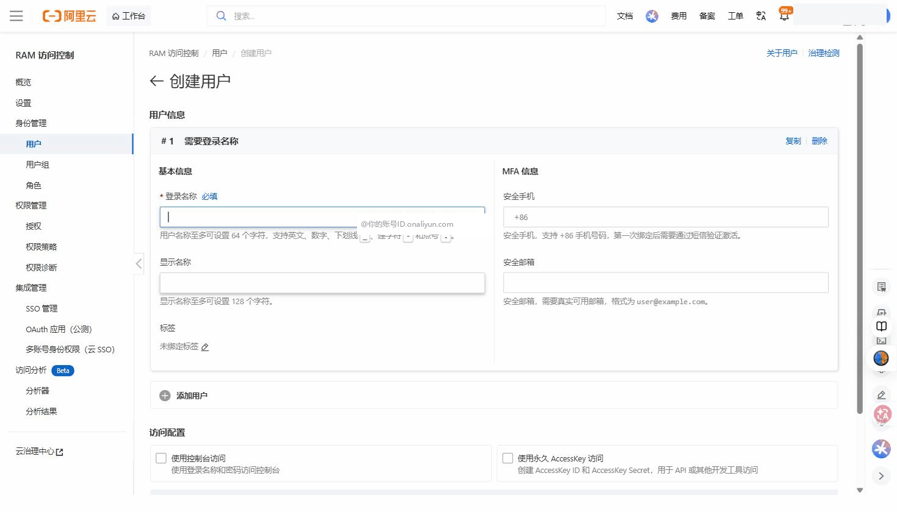
> △ RAM 访问控制 → 身份管理 → 用户 → **创建用户**：填 **登录名称**（后缀是你的账号 ID）、**显示名称**，下方 **访问配置** 勾选「使用控制台访问」+「使用永久 AccessKey 访问」。
> 🔗 官方文档：[创建 RAM 用户](https://help.aliyun.com/zh/ram/user-guide/create-a-ram-user)

填写完毕点击「**确定**」。

**⚠️ 重要：保存 AccessKey（只显示一次！）**

创建成功后，页面会弹出提示框，显示：
```
AccessKey ID:     LTAI5t...（约 20 位字母数字）
AccessKey Secret: xxxxxxxxxxxxxxxxx（约 30 位）
```

立即做以下两件事：
1. 点击「**下载 CSV**」，保存到电脑上安全的地方（如 `C:\Users\你的用户名\Documents\阿里云密钥.csv`）
2. 或者截图保存

> **AccessKey 是什么？** 就像 API 的用户名+密码，程序通过 AccessKey 调用阿里云的接口（如上传文件到 OSS）。Secret 只在创建时显示一次，之后无法再查看，丢了只能重新生成。

**为管理员子账号添加权限：**

1. 用户列表中，点击刚创建的 `zsj-admin`，进入用户详情
2. 点击「**添加权限**」按钮
3. 在搜索框输入 `Administrator`，找到 `AdministratorAccess`，点击添加
4. 点击「**确定**」

`AdministratorAccess` 代表该子账号有管理所有服务的权限，但不能充值和注销主账号。

---

## 1.4 以后都用子账号登录

**找到子账号的专属登录地址：**

1. 主账号登录控制台
2. 右上角头像 → 「**账号基本信息**」
3. 找到「账号ID」，格式类似：`123456789012`（全数字）

**子账号登录地址为：**
```
https://signin.aliyun.com/123456789012/login.htm
```
（把 `123456789012` 替换为你的实际账号 ID）

把这个地址保存为浏览器书签。**从现在起，所有操作用 `zsj-admin` 子账号登录，而不是主账号。**

---

# 第二步：创建 VPC 专有网络

---

> **VPC 是什么？** VPC（Virtual Private Cloud，专有网络）就是在阿里云上给你划出的一块「私有局域网」。你的 ECS 服务器、SAE 应用都放在这个私有局域网里，互相之间用内网 IP 通信，速度快、不收流量费；外部无法直接访问内部服务器，安全。
>
> 想象成：公司内网，只有在公司里的电脑才能互相访问内网资源，外面的人访问不了。

---

## 2.1 选择地域

> **地域是什么？** 阿里云在全国（乃至全球）有多个数据中心，每个叫一个「地域」（Region）。选择地域的原则是：离用户越近越好，延迟越低。
>
> **本实训建议选「华东1（杭州）」**，服务器资源充足，价格合理。

进入控制台后，页面右上角有地域选择器，**先把地域切换到「华东1（杭州）」**，后续所有操作都在这个地域。

---

## 2.2 创建 VPC

**操作路径：** 控制台 → 顶部搜索「**VPC**」→ 点击「**专有网络 VPC**」→ 进入 VPC 控制台 → 点击「**创建专有网络**」

> 如果提示需要开通服务，点击开通即可，VPC 本身免费。

进入创建页面，按以下配置填写：

**VPC 基本信息：**

| 选项 | 填写值 | 说明 |
|------|--------|------|
| 名称 | `zsj-vpc` | 方便识别，可以随意起名 |
| IPv4 网段 | `192.168.0.0/16` | VPC 内所有设备的 IP 地址范围 |
| IPv6 网段 | 不开启 | 本项目不需要 |

> **192.168.0.0/16 是什么意思？**
> - `192.168.0.0` 是起始 IP 地址
> - `/16` 代表前 16 位固定，后 16 位可变，即 IP 范围从 `192.168.0.0` 到 `192.168.255.255`，共 65536 个地址
> - 简单理解：你给这个内网划了一段 IP 地址池，云上的服务器都从这个池子里分配 IP

**交换机（子网）配置：**

交换机（vSwitch）是 VPC 内的子网，每个交换机对应一个可用区。我们至少需要一个交换机。在同一创建页面找到「创建交换机」：

| 选项 | 填写值 | 说明 |
|------|--------|------|
| 名称 | `zsj-switch-a` | 名字加 `-a` 表示 A 可用区 |
| 可用区 | 华东1可用区A（或任意一个） | 一般选 A 区即可 |
| IPv4 网段 | `192.168.1.0/24` | 这个子网的 IP 范围（/24 = 256 个地址） |

> **为什么 VPC 是 /16，交换机是 /24？**
> VPC 是大圈（整个内网），交换机是小圈（子网）。子网的范围必须包含在 VPC 的范围内。`192.168.1.0/24` 就是 `192.168.0.0/16` 里切出来的一个小段（192.168.1.0 ~ 192.168.1.255）。

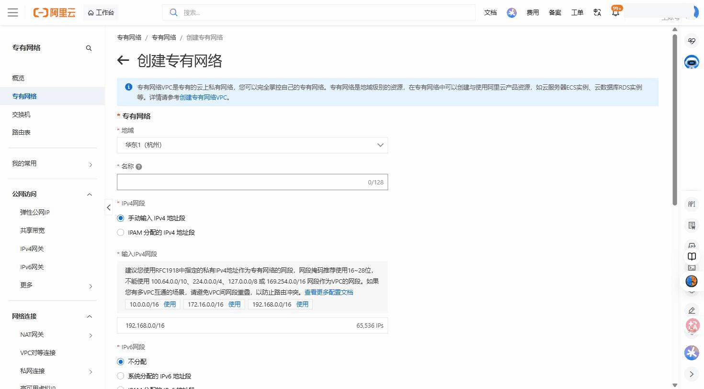
> △ 专有网络 VPC → 专有网络 → **创建专有网络**：**地域** 选「华东1（杭州）」、填 **名称**、**IPv4 网段** 点预设的 `192.168.0.0/16` 的「使用」（IPv6 网段选「不分配」）。同一页面继续填「交换机」即可。
> 🔗 官方文档：[创建和管理专有网络](https://help.aliyun.com/zh/vpc/user-guide/create-and-manage-a-vpc)

点击「**确定**」，稍等片刻（约 10 秒），刷新页面可以看到 VPC 状态变为「**可用**」。

**预期效果：**
- VPC 列表出现 `zsj-vpc`，状态为「可用」
- VPC 内有一个交换机 `zsj-switch-a`，状态为「可用」

---

# 第三步：购买 ECS + 部署 Qdrant

---

> **ECS 是什么？** ECS（Elastic Compute Service，云服务器）就是阿里云上的一台虚拟电脑，全年 24 小时运行，你可以通过 SSH 远程连接它，安装软件，就像操作本地电脑一样。
>
> 我们在 ECS 上运行 Qdrant 数据库（装在 Docker 容器里），所有写手的检索请求最终都会查询这个数据库。

---

## 3.1 购买 ECS

**操作路径：** 控制台 → 搜索「**ECS**」→「**云服务器 ECS**」→ 点击「**创建实例**」

创建实例页面分几个区域，按顺序填写：

### ① 基础配置

| 选项 | 选择 | 说明 |
|------|------|------|
| 付费方式 | **包年包月** | 按月付费，学生实训选 1 个月就够 |
| 地域及可用区 | 华东1（杭州）→ 可用区A | 与 VPC 一致 |
| 实例规格 | 搜索 `ecs.c7.xlarge`（4核8GB） | Qdrant 运行需要一定内存 |
| 镜像 | 公共镜像 → **Ubuntu 22.04 64位** | 稳定的 Linux 版本，教程丰富 |

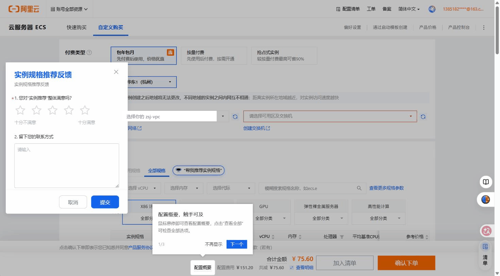
> △ 云服务器 ECS → 创建实例（自定义购买）：从上到下选 **付费类型**（包年包月）、**地域** 华东1（杭州）、**网络及可用区** 选你的 `zsj-vpc` 和交换机，再在 **实例和镜像** 里筛选/搜索规格。
> 🔗 官方文档：[自定义购买实例](https://help.aliyun.com/zh/ecs/user-guide/create-an-instance-by-using-the-wizard)

> **怎么搜索实例规格？** 在「实例规格」区域有搜索框，直接输入 `c7.xlarge`，选第一个结果即可。

### ② 存储配置

| 选项 | 选择 | 说明 |
|------|------|------|
| 系统盘 | ESSD 40GB（默认即可） | 装系统和 Docker |
| 数据盘 | 点击「**添加数据盘**」→ ESSD 100GB | 存 Qdrant 数据，单独一块盘 |

> **为什么要单独一块数据盘？**
> - 系统盘装 Linux 操作系统和软件
> - 数据盘专门存数据，若以后服务器需要迁移，数据盘可以直接挂到新服务器上，不会丢失数据

### ③ 网络配置

| 选项 | 选择 | 说明 |
|------|------|------|
| 专有网络 | 选择 `zsj-vpc` | 把 ECS 放进我们的私有网络 |
| 交换机 | 选择 `zsj-switch-a` | 选择可用区 A 的子网 |
| 公网 IPv4 | **不分配** | 我们用 EIP 代替，更灵活 |
| 安全组 | 点击「**新建安全组**」 | 见下方说明 |

> **新建安全组：**
> 安全组类似防火墙规则，控制哪些 IP 的哪些端口可以访问这台服务器。
> 点击「新建安全组」，名称填 `zsj-sg`，描述填「众生界服务器安全组」，选「普通安全组」，点确定。
> 先用默认规则，我们在 3.3 节详细配置。

### ④ 登录方式（重要）

| 选项 | 选择 |
|------|------|
| 登录方式 | 选「**密钥对**」（比密码更安全） |

> **密钥对是什么？** 就像门锁和钥匙：服务器上存着锁（公钥），你电脑上存着钥匙（私钥 .pem 文件）。有私钥才能开门，不需要记密码。

点击「**新建密钥对**」：
- 密钥对名称：`zsj-key`
- 密钥对类型：RSA 2048（默认）
- 点击「**确定**」

**⚠️ 系统会立即下载一个 `zsj-key.pem` 文件**，这是你进入服务器的唯一钥匙，**立即保存到安全位置**：

```
C:\Users\你的用户名\.ssh\zsj-key.pem
```

> 如果 `.ssh` 目录不存在，手动创建它：打开文件资源管理器，进入 `C:\Users\你的用户名\`，新建文件夹 `.ssh`。

### ⑤ 确认购买

- 数量：1 台
- 购买时长：1 个月
- 检查配置摘要，确认后点击「**立即购买**」，完成支付

**预期效果：**
- ECS 控制台出现新实例，等待约 1-2 分钟，状态变为「**运行中**」

---

## 3.2 申请并绑定 EIP（弹性公网 IP）

> **为什么不直接在 ECS 上分配公网 IP？**
> 直接分配的公网 IP 与服务器绑定，服务器被删则 IP 消失。而 EIP 是独立的资源，可以从 A 服务器解绑后绑定到 B 服务器，IP 不变。这对于生产环境很重要：维护时换服务器，所有写手不需要更新配置。

**操作路径：** 控制台 → 搜索「**EIP**」→「**弹性公网 IP**」→「**申请弹性公网 IP**」

填写配置：

| 选项 | 选择 | 说明 |
|------|------|------|
| 地域 | 华东1（杭州） | 必须与 ECS 同地域 |
| 线路类型 | BGP（多线） | 默认，全国访问速度均衡 |
| 计费方式 | **按使用流量** | 流量少的话比按固定带宽便宜 |
| 带宽峰值 | 100 Mbps | 够用 |
| 购买数量 | 1 个 |  |

点击「**立即购买**」。

**将 EIP 绑定到 ECS：**

1. 回到 EIP 列表，找到刚申请的 EIP
2. 右侧点击「**绑定资源**」
3. 在弹出的对话框中：
   - 资源类型：选「**ECS实例**」
   - ECS 实例：从下拉框选择刚才创建的实例（应该显示你之前填写的名称）
4. 点击「**确定**」

**记录 EIP 地址：**
绑定后，EIP 详情页显示一个公网 IP 地址，格式如 `47.98.xxx.xxx`。**把这个 IP 记下来**，后面很多步骤要用到。

---

## 3.3 配置安全组规则

> **安全组规则说明：** 安全组控制「哪些来源的请求可以访问服务器的哪个端口」。默认只开放了 22（SSH）端口。我们需要手动添加 Qdrant 的 6333 端口，但只允许 VPC 内部访问。

**操作路径：** ECS 控制台 → 左侧「**网络与安全**」→「**安全组**」→ 点击 `zsj-sg` → 「**管理规则**」→「**入方向**」→「**手动添加**」

添加以下规则（如果 22 端口规则已存在则跳过）：

| 规则 | 协议类型 | 端口范围 | 授权对象 | 说明 |
|------|---------|---------|---------|------|
| 规则1 | TCP | 22/22 | 0.0.0.0/0 | SSH 远程连接（全网开放） |
| 规则2 | TCP | 6333/6333 | 192.168.0.0/16 | Qdrant 端口，仅 VPC 内网访问 |

> **为什么 Qdrant 只允许 192.168.0.0/16 访问？**
> `192.168.0.0/16` 就是我们 VPC 的内网地址段。这样配置意味着：只有也在这个 VPC 里的服务（比如 SAE）才能访问 Qdrant，互联网上的陌生人无法直接连到数据库，安全很多。

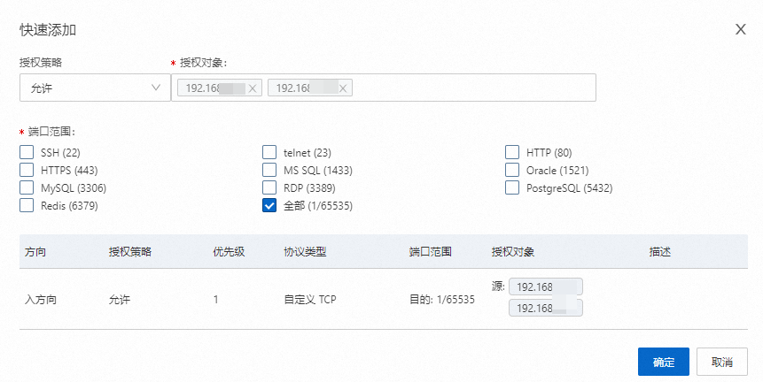
> △ 阿里云官方文档截图：添加安全组规则——填授权对象和端口范围，下方实时预览生成的规则

添加后点击「**保存**」。

> **📌 注意：第七步（数据迁移）时需要临时把 6333 端口向全网开放，迁移完后立即恢复为仅 VPC 内网。** 届时文档会明确提醒，请按步骤操作，不要忘记恢复。

---

## 3.4 用 FinalShell 连接服务器

> **FinalShell 是什么？** 一款图形化 SSH 连接工具，界面直观，左侧是文件管理器，右侧是终端窗口，还可以实时查看服务器 CPU/内存使用情况。推荐初学者使用。

**第一步：下载安装 FinalShell**

1. 打开浏览器，百度搜索「FinalShell 官网下载」
2. 进入官网 `www.hostbuf.com`，下载 Windows 版本
3. 双击安装包，一路「下一步」完成安装

**第二步：新建 SSH 连接**

1. 打开 FinalShell
2. 点击左上角的「**+**」图标（或菜单「文件」→「新建连接」）
3. 选择「**SSH 连接**」
4. 填写连接信息：

| 字段 | 填写值 |
|------|--------|
| 名称 | `众生界ECS` |
| 主机 | `47.98.xxx.xxx`（你的 EIP 公网 IP） |
| 端口 | `22` |
| 用户名 | `root` |
| 认证方式 | 选「**公钥**」 |
| 私钥 | 点击文件夹图标，选择 `C:\Users\你的用户名\.ssh\zsj-key.pem` |

5. 点击「**确定**」保存

**第三步：连接服务器**

双击刚创建的「众生界ECS」连接，FinalShell 会弹出安全提示「首次连接，是否信任该主机？」，点击「**接受并保存**」。

**连接成功的标志：**
终端窗口出现以下提示（具体内容因系统版本而异）：

```
Welcome to Ubuntu 22.04.3 LTS (GNU/Linux 5.15.0-91-generic x86_64)

root@iZ2ze.....:~#
```

看到 `root@...#` 这样的命令提示符，说明已经成功登录服务器。

**如果连不上，检查以下几点：**
- EIP 是否已绑定到 ECS（EIP 列表查看「绑定实例」列）
- 安全组 22 端口是否开放（授权对象是否 `0.0.0.0/0`）
- 私钥文件路径是否正确，文件名是否为 `zsj-key.pem`

---

## 3.5 挂载数据盘

> 服务器买好后，100GB 数据盘还没有格式化和挂载，就像买了一块硬盘还没插到电脑里。下面的步骤就是「格式化」并「挂载」数据盘，之后才能往里面写数据。

在 FinalShell 的终端窗口（右侧黑色区域）输入以下命令，每条命令输入后按 Enter：

**查看磁盘列表，确认数据盘名称：**

```bash
lsblk
```

**预期输出（不同服务器 vdb 名称可能略有不同，但 100GB 那块就是数据盘）：**

```
NAME   MAJ:MIN RM  SIZE RO TYPE MOUNTPOINT
vda    252:0    0   40G  0 disk
└─vda1 252:1    0   40G  0 part /
vdb    252:16   0  100G  0 disk           ← 这就是数据盘，MOUNTPOINT 列为空表示未挂载
```

**格式化数据盘（只执行一次，会清空磁盘，确保是新盘再操作）：**

```bash
mkfs.ext4 /dev/vdb
```

输入后系统会问你确认，输入 `y` 按 Enter，等待约 10 秒，看到 `done` 说明格式化完成。

**创建挂载点并挂载：**

```bash
# 创建 /data 目录作为挂载点
mkdir -p /data

# 把 vdb 磁盘挂载到 /data 目录
mount /dev/vdb /data

# 验证是否挂载成功（应该看到 /data 占用 0%，100GB 容量）
df -h | grep /data
```

**预期输出：**

```
/dev/vdb         98G   24K   93G   1% /data
```

**设置开机自动挂载（重要，否则重启服务器后数据盘消失）：**

```bash
echo '/dev/vdb /data ext4 defaults 0 0' >> /etc/fstab
```

验证 fstab 写入正确：

```bash
cat /etc/fstab | grep /data
```

**预期看到：** `/dev/vdb /data ext4 defaults 0 0`

---

## 3.6 安装 Docker 并部署 Qdrant

> **为什么用 Docker 运行 Qdrant？** Docker 让我们不用手动安装 Qdrant 的各种依赖，只需要一条命令就能启动一个完整的 Qdrant 实例，并且版本可控、升级方便。

**安装 Docker：**

```bash
# 更新系统软件包列表
apt update

# 使用官方一键安装脚本安装 Docker（需等待约 2-3 分钟）
curl -fsSL https://get.docker.com | sh

# 启动 Docker 服务
systemctl start docker

# 设置 Docker 开机自启动
systemctl enable docker

# 验证 Docker 安装成功（应显示版本号）
docker --version
```

**预期输出：** `Docker version 26.x.x, build xxxxxxx`

**创建 Qdrant 的数据目录和配置目录：**

```bash
mkdir -p /data/qdrant/storage
mkdir -p /data/qdrant/config
```

**创建 Qdrant 配置文件（设置密码保护数据库）：**

> **⚠️ 必须修改密码！** 下方代码中的 `ZsjCloud2026@Qdrant#DB` 仅为**示例**，全文所有出现此字符串的地方都要替换为你自己设置的密码。密码一旦泄露，任何知道 ECS 公网 IP 的人都能在迁移窗口期直接删除你的数据库。请用密码管理器（或纸质密码本）记好，不要存在未加密的地方。

```bash
# ★ 把「ZsjCloud2026@Qdrant#DB」全部替换为你自己设置的强密码
# 密码建议：大小写字母+数字+符号，至少 20 位，例如：Zsj@2026#Qdr4nt!Prod
cat > /data/qdrant/config/config.yaml << 'EOF'
storage:
  storage_path: /qdrant/storage

service:
  host: 0.0.0.0
  http_port: 6333

api_key: "ZsjCloud2026@Qdrant#DB"
EOF
```

验证配置文件内容：

```bash
cat /data/qdrant/config/config.yaml
```

**预期输出：**

```yaml
storage:
  storage_path: /qdrant/storage

service:
  host: 0.0.0.0
  http_port: 6333

api_key: "ZsjCloud2026@Qdrant#DB"
```

**启动 Qdrant 容器：**

```bash
docker run -d \
  --name qdrant \
  --restart always \
  -p 6333:6333 \
  -v /data/qdrant/storage:/qdrant/storage \
  -v /data/qdrant/config/config.yaml:/qdrant/config/config.yaml \
  qdrant/qdrant:latest \
  ./qdrant --config-path /qdrant/config/config.yaml
```

> **命令说明：**
> - `-d`：后台运行（不占用终端窗口）
> - `--restart always`：服务器重启后自动恢复 Qdrant
> - `-p 6333:6333`：把容器的 6333 端口映射到服务器的 6333 端口
> - `-v ...`：把服务器上的目录挂载到容器内（数据存在服务器上，不在容器里）

等待约 10-20 秒（镜像下载 + 启动），然后验证：

```bash
# 查看容器是否在运行（STATUS 列应显示 Up xx seconds）
docker ps | grep qdrant
```

**预期输出（部分）：**

```
abc123def456   qdrant/qdrant:latest   ...   Up 15 seconds   0.0.0.0:6333->6333/tcp   qdrant
```

**测试 Qdrant 是否正常工作：**

```bash
# 把【你的密码】替换为你在配置文件里设置的密码
curl -H "api-key: ZsjCloud2026@Qdrant#DB" http://localhost:6333/collections
```

**预期输出：**

```json
{"result":{"collections":[]},"status":"ok","time":0.000123}
```

看到 `"status":"ok"` 说明 Qdrant 运行正常！`collections` 为空是因为还没有导入数据，这是正常的。

**如果看不到预期输出，排查步骤：**

```bash
# 查看容器日志，找到错误原因
docker logs qdrant
```

常见错误：
- `permission denied`：目录权限问题，运行 `chmod -R 777 /data/qdrant`
- `api_key: unexpected field`：配置文件格式错误，重新运行 cat 命令生成配置

---

# 第四步：配置 OSS 存放模型文件

---

> **为什么要把模型文件放到 OSS？**
> BGE-M3 模型约 2.3GB，如果每个新写手都需要从管理员电脑拷贝，用 U 盘或发送文件很慢，而且容易出错。放到 OSS（云端网盘）后，新写手只需要知道 Bucket 名称和 AccessKey 就能自助下载，管理员不需要一个个帮忙传文件。

---

## 4.1 开通 OSS 并创建存储桶

**操作路径：** 控制台首页 → 顶部搜索「**OSS**」→「**对象存储 OSS**」

第一次进入会提示开通服务，点击「**立即开通**」，选择「**按量付费**」（流量少就付费少），确认开通。

进入 OSS 管理控制台后，点击「**创建 Bucket**」：

| 选项 | 填写/选择 | 说明 |
|------|---------|------|
| Bucket 名称 | `zsj-models-2026` | 全局唯一（整个阿里云都唯一），建议后面加年份或数字 |
| 地域 | 华东1（杭州） | 与 ECS 同地域，内网传输更快 |
| 存储类型 | 标准存储 | 频繁访问选标准 |
| 读写权限 | **私有** | 必须是私有！不然模型文件会公开 |
| 版本控制 | 关闭 | 不需要 |

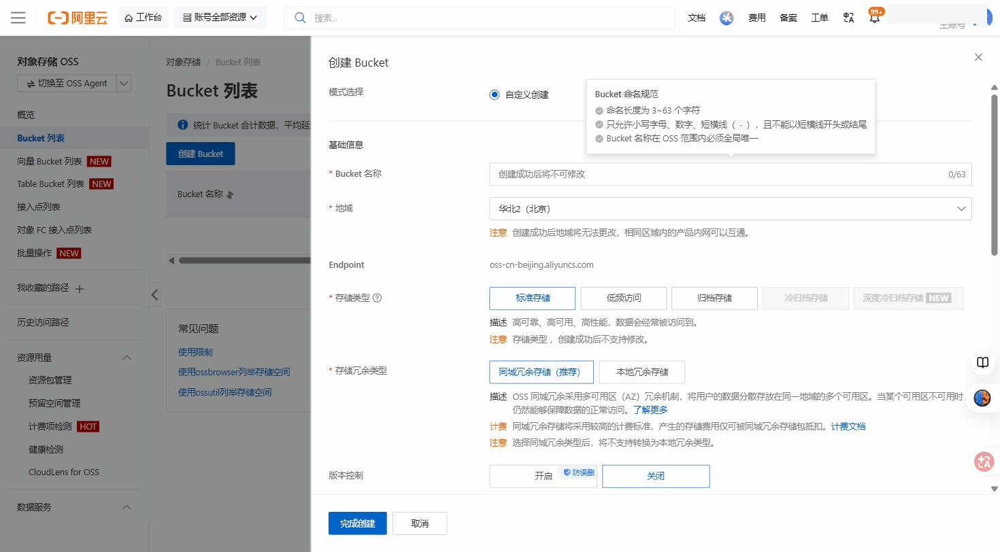
> △ 对象存储 OSS → Bucket 列表 → **创建 Bucket**：填全局唯一的 **Bucket 名称**、**地域** 选「华东1（杭州）」（与 ECS 同地域）、**存储类型** 选「标准存储」；往下滚到 **读写权限** 选「私有」、**版本控制** 选「关闭」。
> 🔗 官方文档：[创建存储空间 Bucket](https://help.aliyun.com/zh/oss/user-guide/create-a-bucket-4)

填写后点击「**确定**」，Bucket 创建完成。

---

## 4.2 安装 OSS Browser（推荐）

> **为什么用 OSS Browser 而不是网页上传？**
> 模型文件有几十个小文件，网页端一次只能选少量文件上传，很慢。OSS Browser 是阿里云官方的桌面客户端，支持拖拽批量上传，速度快得多，还能断点续传。

**下载方式：**
1. 在阿里云帮助文档搜索「**ossbrowser**」，打开"安装和登录 ossbrowser"文档页，里面有各平台官方下载链接（也可以百度搜索「阿里云 ossbrowser 下载」）
2. 选择 Windows 版本下载，解压即用（绿色软件，无需安装）

**登录 OSS Browser：**

打开 OSS Browser，登录界面填写：

| 字段 | 填写值 |
|------|--------|
| Endpoint | `oss-cn-hangzhou.aliyuncs.com`（华东1杭州的地址） |
| AccessKey ID | 你的 `zsj-admin` 子账号的 AccessKey ID |
| AccessKey Secret | 对应的 Secret |
| Bucket（可选） | `zsj-models-2026` |

> **Endpoint 是什么？** 是 OSS 服务的访问地址，每个地域不同。华东1杭州是 `oss-cn-hangzhou.aliyuncs.com`。其他地域的 Endpoint 可以在 OSS 控制台「Bucket 概览」页面找到。

点击「**登录**」，进入 OSS Browser 主界面，可以看到左侧有 Bucket 列表。

---

## 4.3 上传 BGE-M3 模型到 OSS

**在本机找到 BGE-M3 模型文件夹：**

本地模型存放在：
```
E:\huggingface_cache\hub\models--BAAI--bge-m3\
```

打开文件资源管理器，进入这个目录，应该看到有 `blobs/`、`refs/`、`snapshots/` 等子文件夹。

**在 OSS Browser 中创建文件夹并上传：**

1. 在 OSS Browser 中进入 `zsj-models-2026` Bucket
2. 点击「**新建目录**」，名称填 `bge-m3`
3. 双击进入 `bge-m3/` 目录
4. 点击「**上传**」→「**上传文件夹**」
5. 选择本地的 `E:\huggingface_cache\hub\models--BAAI--bge-m3\` 整个文件夹
6. 点击「**确定**」，开始上传

**上传过程：**
- 进度条显示各文件上传状态
- 总文件大小约 2.3GB，根据你的上行带宽，通常需要 15-60 分钟
- 不要关闭 OSS Browser，可以在旁边做其他事情

**验证上传成功：**

上传完成后，在 OSS Browser 中查看 `bge-m3/` 目录，应看到 `blobs/`、`snapshots/` 等子文件夹，文件数量和本地相同。

---

## 4.4 记录 OSS 信息（第九步分发写手用）

| 信息 | 内容 |
|------|------|
| OSS Endpoint | `oss-cn-hangzhou.aliyuncs.com` |
| Bucket 名称 | `zsj-models-2026` |
| 模型路径 | `bge-m3/` |

写手需要用他们自己的 AccessKey 下载，AccessKey 的创建在第九步完成。

---

# 第五步：部署检索 API 到 SAE

---

> **SAE 是什么？** SAE（Serverless Application Engine，无服务器应用引擎）是阿里云的应用托管平台。我们把 Python 写的 FastAPI 检索服务打包成 Docker 镜像，推到 SAE，SAE 会自动管理服务器资源，我们不需要关心服务器配置、扩缩容等问题。
>
> **为什么不把检索服务也放在 ECS 上？**
> 理论上可以，但 SAE 有独立的网络和访问控制，更符合微服务架构设计。而且 SAE 支持自动扩缩容，写手多了不会拥堵。

---

## 5.1 准备检索 API 代码

这一步需要在项目目录下创建 `zsj-api/` 子目录，包含三个文件：

| 文件 | 作用 |
|------|------|
| `zsj-api/main.py` | FastAPI 检索服务主程序，提供 `/health`、`/collections`、`/search/dense`、`/search/hybrid` 四个接口；运行时从 SAE 环境变量读取 Qdrant 连接信息 |
| `zsj-api/requirements.txt` | Python 依赖声明（fastapi、uvicorn、qdrant-client、pydantic），构建镜像时安装 |
| `zsj-api/Dockerfile` | 以 `python:3.11-slim` 为基础，先装依赖再复制代码，监听 8080 端口 |

> **Dockerfile 工作原理：**
> - `FROM python:3.11-slim`：以官方 Python 3.11 镜像为基础（slim 版本体积更小）
> - 先 `COPY requirements.txt` 再 `pip install`：利用 Docker 缓存层，代码改了不重装依赖，构建更快
> - `EXPOSE 8080`：声明容器内服务监听 8080 端口
> - `CMD ["uvicorn", ...]`：容器启动时自动运行 API 服务

---

### → 执行实施计划 P1

打开终端，使用 opencode（或按指导书 AGENTS.md 规范手动创建），读取并执行：

```
docs/实施计划_二阶段_P1_云端检索API服务.md
```

**执行后你将得到：**
- `zsj-api/main.py` — 完整 FastAPI 服务（含 RRF 混合检索）
- `zsj-api/requirements.txt` — 4 个依赖包
- `zsj-api/Dockerfile` — 可直接用于 `docker build`

**验收：** 计划 P1 的 Stage 1-2 测试通过（语法检查 + 依赖声明验证）后继续下一节。

---

<!--以下内容为占位，保留结构，实际内容见实施计划 P1-->
<!--P1_PLACEHOLDER_START-->
<!--P1_PLACEHOLDER_END-->

---

## 5.2 开通容器镜像服务（ACR）

> **ACR 是什么？** ACR（Alibaba Cloud Container Registry，容器镜像服务）是阿里云的 Docker 镜像仓库，类似 Docker Hub 但在国内。SAE 从 ACR 拉取镜像来运行我们的服务。

**操作路径：** 控制台 → 搜索「**容器镜像服务**」→ 点击进入 → 选择「**个人版**」→ 点击「**开通服务**」

> 个人版免费，对于此场景完全够用。

**创建命名空间（Namespace）：**

> 命名空间就像文件夹，用于组织镜像仓库。

1. 进入 ACR 控制台，左侧找到「**命名空间**」
2. 点击「**创建命名空间**」
3. 命名空间名称填 `zsj`（只能用小写字母、数字、横杠）
4. 访问级别选「**私有**」
5. 点击「**确定**」

**创建镜像仓库：**

1. 左侧找到「**镜像仓库**」→「**创建镜像仓库**」
2. 填写信息：

| 字段 | 填写值 |
|------|--------|
| 命名空间 | 选择刚创建的 `zsj` |
| 仓库名称 | `zsj-api` |
| 仓库类型 | 私有 |
| 摘要 | 众生界检索API镜像 |

3. 下一步「**代码源**」选「**本地仓库**」（我们手动推送，不需要自动构建）
4. 点击「**创建镜像仓库**」

**记录仓库地址：**

创建成功后，点击仓库名称进入详情，在「**基本信息**」里可以看到：

```
公网地址: registry.cn-hangzhou.aliyuncs.com/zsj/zsj-api
VPC内网地址: registry-vpc.cn-hangzhou.aliyuncs.com/zsj/zsj-api
```

---

## 5.3 构建 Docker 镜像并推送到 ACR

> **前提：本机需要安装 Docker Desktop。** 如果没有安装，在 Docker 官网下载 Docker Desktop for Windows 并安装。

**设置 ACR 登录密码（如果没有设置过）：**

1. 在 ACR 控制台右上角点击「**访问凭证**」
2. 点击「**修改 Registry 登录密码**」
3. 设置一个密码（与阿里云账号密码不同，专门用于 docker login）

**在本机 PowerShell（管理员模式）执行以下命令：**

```powershell
# 进入你的代码目录（替换为实际路径）
cd D:\工作\zsj-api

# 登录阿里云镜像仓库
# 输入后会提示输入密码，填写刚才设置的 Registry 登录密码
docker login --username=你的RAM子账号登录名 registry.cn-hangzhou.aliyuncs.com
```

**预期输出：** `Login Succeeded`

```powershell
# 构建 Docker 镜像
# -t 后面是镜像的名字和标签，. 代表当前目录的 Dockerfile
docker build -t registry.cn-hangzhou.aliyuncs.com/zsj/zsj-api:v1.0 .
```

**构建过程输出（正常应该有多步，最后一行是 `Successfully built ...`）：**

```
[+] Building 45.2s (9/9) FINISHED
 => [1/4] FROM docker.io/library/python:3.11-slim
 => [2/4] WORKDIR /app
 => [3/4] RUN pip install --no-cache-dir -r requirements.txt
 => [4/4] COPY main.py .
 => exporting to image
 => => writing image sha256:abc123...
 => => naming to registry.cn-hangzhou.aliyuncs.com/zsj/zsj-api:v1.0
```

```powershell
# 推送镜像到 ACR
docker push registry.cn-hangzhou.aliyuncs.com/zsj/zsj-api:v1.0
```

**预期输出（每层都显示 Pushed 或 Layer already exists）：**

```
v1.0: digest: sha256:abc123... size: 1234
```

**在 ACR 控制台验证：** 进入镜像仓库 `zsj/zsj-api`，「**镜像版本**」中应看到 `v1.0` 标签。

---

## 5.4 在 SAE 创建命名空间

**操作路径：** 控制台 → 搜索「**SAE**」→「**Serverless 应用引擎**」→ 进入控制台

> 第一次进入可能提示开通服务和授权，按提示操作即可。

**创建命名空间：**

SAE 控制台左侧找到「**命名空间**」→「**创建命名空间**」

| 选项 | 填写 | 说明 |
|------|------|------|
| 地域 | 华东1（杭州） | 与 VPC 一致 |
| 命名空间名称 | `zsj-prod` | prod 代表生产环境 |
| 命名空间 ID | 自动生成或填 `cn-hangzhou:zsj-prod` |  |
| VPC | 选择 `zsj-vpc` | 让 SAE 应用在 VPC 内运行 |
| vSwitch | 选择 `zsj-switch-a` |  |

点击「**确定**」。

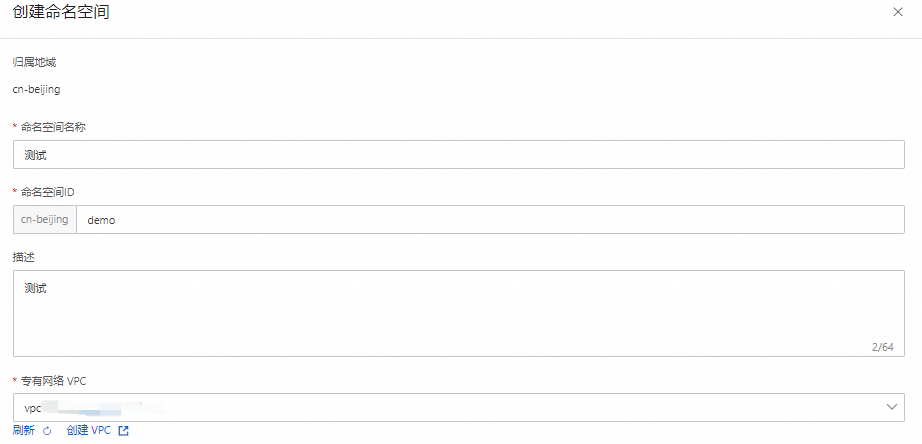
> △ 阿里云官方文档截图：创建命名空间——注意底部的"专有网络 VPC"下拉，必须选 `zsj-vpc`

> **为什么 SAE 也要配置 VPC？** 这样 SAE 里的应用分配的是 VPC 内网 IP，就能直接通过内网 IP 访问 ECS 上的 Qdrant（6333 端口只对 VPC 内网开放）。

---

## 5.5 创建 SAE 应用

进入 SAE 控制台 → 左侧「**应用列表**」→「**创建应用**」

> ⚠️ **对照现行控制台（SAE 2.0）**：现在 SAE 概览页/创建入口会先让你选 **轻量版 / 标准版 / 专业版**。本项目检索 API 是无状态 Web 服务，选 **标准版**（需要微服务治理）或 **轻量版**（够用且更省）均可；选好版本后再进入下面的「应用基本信息」表单。

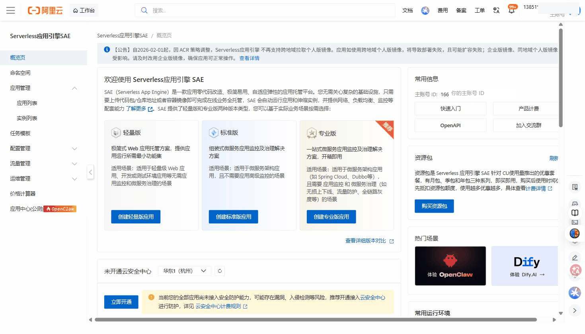
> △ Serverless 应用引擎 SAE 概览页（现行 saenext 控制台）：先选 **轻量版 / 标准版 / 专业版** 再创建应用；顶部公告即下方「镜像地址」要注意的 ACR 策略（见 5.3 提示）。
> 🔗 官方文档：[在 SAE 控制台创建并部署应用](https://help.aliyun.com/zh/sae/use-cases/create-and-deploy-an-application-in-the-sae-console)

**基本信息：**

| 选项 | 填写 | 说明 |
|------|------|------|
| 应用名称 | `zsj-retrieval-api` | 只能用字母数字和横杠 |
| 命名空间 | 选择刚创建的 `zsj-prod` |  |
| 应用描述 | 众生界检索API服务 |  |

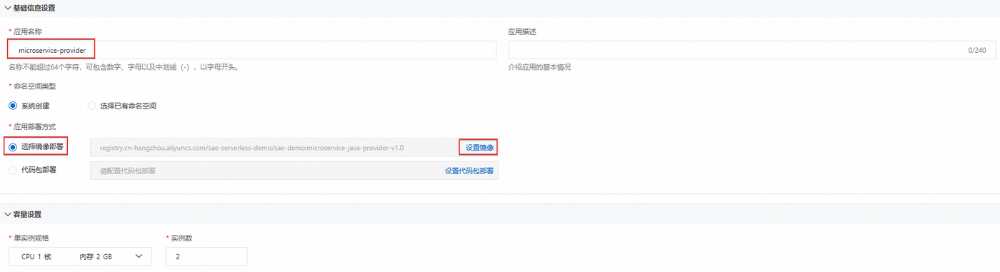
> △ 阿里云官方文档截图：创建应用第一步——应用名称、部署方式、资源规格都在这张表单里

**选择部署方式（重要）：**

找到「**应用部署方式**」，选择「**镜像部署**」

| 选项 | 填写 |
|------|------|
| 镜像地址 | `registry-vpc.cn-hangzhou.aliyuncs.com/zsj/zsj-api:v1.0`（VPC 内网地址，拉取速度更快） |
| 端口映射 | 容器端口 `8080` |

> ⚠️ **对照现行阿里云策略（重要）**：自 2026-02-01 起，因 ACR 策略调整，**SAE 不再支持跨地域拉取 ACR 个人版镜像**——跨地域会部署失败、扩容失败。所以务必保证 **ACR 实例（第 5.2/5.3 步）与 SAE 应用在同一地域**（本项目都在 `cn-hangzhou` 杭州，镜像地址前缀 `registry-vpc.cn-hangzhou...` 与 SAE 同地域，合规）。若改用其它地域或企业版镜像，按此原则对应调整。（SAE 概览页顶部公告即此条。）

**资源配置：**

| 选项 | 选择 |
|------|------|
| 实例数 | 1 |
| CPU | 1 核 |
| 内存 | 2 GB |

**配置环境变量（最关键的一步）：**

向下滚动找到「**环境变量**」区域，点击「**添加变量**」，逐行添加以下 3 个变量：

| 变量名 | 变量值 | 如何获取 |
|--------|--------|---------|
| `QDRANT_HOST` | `192.168.1.xxx` | ECS 实例详情页的「**私有 IP 地址**」（不是公网IP！） |
| `QDRANT_PORT` | `6333` | 固定值，直接填 |
| `QDRANT_API_KEY` | `ZsjCloud2026@Qdrant#DB` | 第三步 3.6 设置的 Qdrant 密码 |

> **怎么查 ECS 的私有 IP（详细步骤）：**
> 1. 打开阿里云控制台，顶部搜索「ECS」→「云服务器 ECS」
> 2. 左侧点「**实例**」，找到你创建的那台服务器，点击实例名称（蓝色链接）
> 3. 进入实例详情页，向下滚动找到「**网络信息**」区块
> 4. 其中「**私有 IP 地址**」一行，显示格式如 `192.168.1.58`，这就是要填的值
>
> **也可以在 FinalShell 里查：** 连接服务器后执行 `hostname -I`，第一个 IP（`192.168.x.x` 段）即为内网 IP。

> **⚠️ 这里必须填内网 IP，绝对不能填公网 EIP（47.xxx.xxx.xxx）。** SAE 和 ECS 在同一 VPC 里走内网通信；而安全组的 6333 端口只对内网开放（`192.168.0.0/16`），填公网 IP 会导致 SAE 无法连通 Qdrant，应用启动即崩溃。这是初学者最常踩的坑。

**确认创建：**

检查所有配置后，点击「**确认创建**」。

等待约 1-3 分钟，应用状态变为「**运行中**」。

**验证应用运行状态：**

进入应用详情 → 「**变更记录**」，最新一条应显示「发布成功」。

进入「**日志**」→「**应用日志**」，应看到类似：

```
INFO:     Started server process [1]
INFO:     Waiting for application startup.
INFO:     Application startup complete.
INFO:     Uvicorn running on http://0.0.0.0:8080 (Press CTRL+C to quit)
```

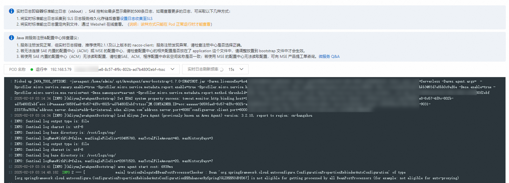
> △ 阿里云官方文档截图：SAE 实时日志长这样，在这里确认上面的启动信息

**如果应用启动失败（状态为「异常」），查看日志：**
- 最常见原因：环境变量 `QDRANT_HOST` 填的是公网 IP 导致连接超时
- 检查 `QDRANT_API_KEY` 是否与 Qdrant 配置文件里的一致

---

## 5.6 为 SAE 配置 CLB（负载均衡）

> **为什么需要 CLB？** API 网关需要一个稳定的 IP 地址来访问 SAE 里的服务，SAE 应用的内网 IP 每次重启可能变化，但 CLB 的 IP 固定，通过 CLB 访问更稳定。
>
> **术语说明：** CLB（传统型负载均衡）就是以前的 SLB，阿里云已改名，控制台现在显示 CLB。本文后面提到的「SLB」均指它。

**操作路径（官方文档路径）：** SAE 应用详情 → 「**基础信息**」页的「**应用访问设置**」区域 → 「**添加私网 CLB 访问**」

| 选项 | 填写 |
|------|------|
| 监听协议 | HTTP |
| HTTP 端口 | `80` |
| 容器端口 | `8080` |
| CLB 实例 | 选「**新建**」——SAE 会自动**代购**一个全新的 CLB 实例并绑定，无需自己选规格 |

点击「**确定**」，等待约 1 分钟 CLB 创建完成。

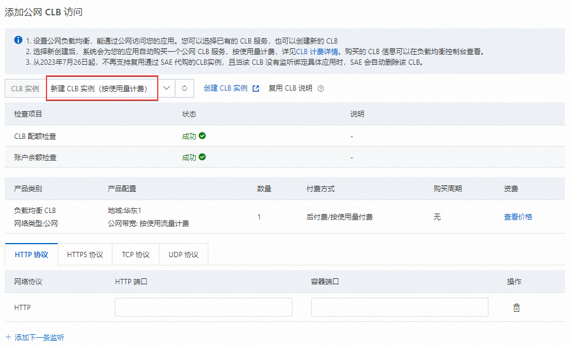
> △ 阿里云官方文档截图：添加 CLB 访问的弹窗（图为公网 CLB，私网 CLB 界面相同），按表填监听端口和容器端口

**记录 CLB 的私网 IP 地址：**

CLB 创建完成后，「应用访问设置」区域显示私网访问地址，格式如 `192.168.1.yyy:80`。**把这个 IP 记下来，第六步 API 网关配置要用。**

---

# 第六步：配置 API 网关

---

> **API 网关是整个架构的门卫。** 写手机器直接访问 API 网关（有公网 IP），API 网关验证 AppCode，然后把请求转发到 VPC 内网里的 SAE（SAE 没有公网入口）。这样 SAE 和 Qdrant 完全隐藏在内网，外面只能看到 API 网关。

---

## 6.1 开通 API 网关

**操作路径：** 控制台 → 搜索「**API 网关**」→ 点击进入 → 按提示开通服务

> API 网关按调用次数计费，学生测试量级费用可以忽略不计。

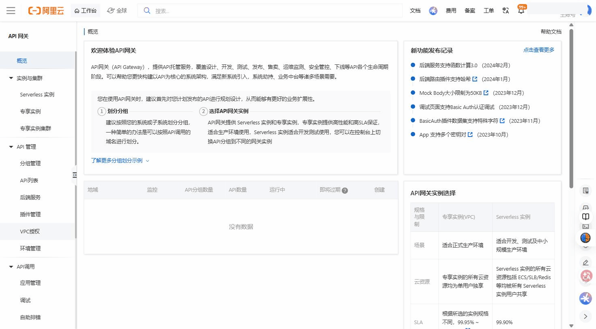
> △ API 网关控制台概览：左侧菜单 **API 管理 → 分组管理 / API 列表 / 后端服务 / VPC 授权 / 环境管理**、**API 调用 → 应用管理**，本步骤后面用到的都在这里。
> 🔗 官方文档：[API 网关产品概述](https://help.aliyun.com/zh/api-gateway/traditional-api-gateway/product-overview/what-is-api-gateway)

> ⚠️ **对照现行控制台**：① 这里指的是 **传统 API 网关**（带 AppCode 鉴权、共享/Serverless 实例），不是新版「云原生 API 网关」，搜索时认准带"分组管理/API 列表"菜单的这个。② 文档下文写的「**共享实例**」在现行控制台叫 **Serverless 实例**（适合开发测试，可免费用），创建分组时选它即可；正式生产才用「专享实例」。

---

## 6.2 创建 API 分组

> **分组是什么？** 一个分组对应一个域名（二级域名），下面可以有多个 API。我们把所有检索 API 都放在一个分组里。

进入 API 网关控制台 → 左侧「**分组管理**」→「**创建分组**」

| 选项 | 填写 |
|------|------|
| 分组名称 | `zsj-api-group` |
| 分组描述 | 众生界检索API分组 |
| 实例类型 | **共享实例**（免费，学生够用） |

点击「**确定**」。

创建成功后，在分组列表找到 `zsj-api-group`，右侧会显示一个「**二级域名**」，格式类似：

```
abc123def456.cn-hangzhou.alicloudapi.com
```

**⚠️ 把这个域名记下来！** 这是写手机器访问 API 的地址，第八步要填入 `config.json`。

---

## 6.3 配置 VPC 授权

> **为什么要 VPC 授权？** SAE（SLB）在 VPC 内网，API 网关在公网。API 网关要访问内网服务，需要先获得「VPC 授权」，告诉阿里云「允许这个 API 网关访问 VPC 里指定 IP 的指定端口」。

**操作路径：** API 网关控制台 → 左侧「**VPC授权**」→「**添加授权**」

| 选项 | 填写 | 说明 |
|------|------|------|
| 名称 | `zsj-sae-slb` |  |
| VPC | 选择 `zsj-vpc` | 我们的专有网络 |
| 实例 ID 或 IP | 填写 SAE CLB 的**私网 IP**（5.6 节记录的） | `192.168.1.yyy` |
| 端口 | `80` | CLB 监听的端口 |

点击「**确定**」。

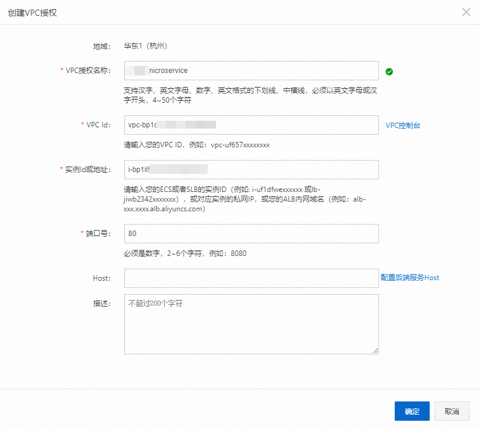
> △ 阿里云官方文档截图：创建 VPC 授权——选 VPC、填实例 IP 和端口

---

## 6.4 创建 API（需要创建 4 个）

进入 API 网关控制台 → 左侧「**API 管理**」→「**创建 API**」

我们需要创建 4 个 API，每个步骤相同，只是名称、路径和方法不同。先以 `search-dense` 为例，详细说明步骤：

**第一步：基本信息**

| 选项 | 填写 |
|------|------|
| 所属分组 | 选择 `zsj-api-group` |
| API 名称 | `search-dense` |
| API Path（请求路径） | `/search/dense` |
| HTTP Method | `POST` |
| 描述 | 密集向量检索 |

**安全认证配置：**

「**安全认证**」选「**阿里云APP**」，下方出现的「**AppCode 认证**」选「**允许 AppCode 认证（Header & Query）**」

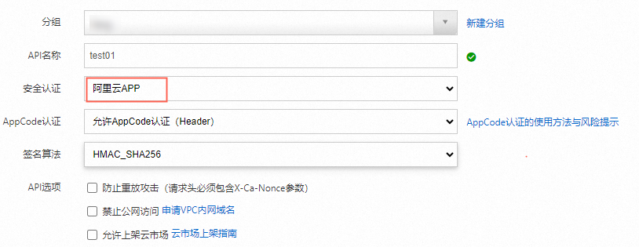
> △ 阿里云官方文档截图：安全认证选"阿里云APP"（红框），AppCode 认证在它下面单独一行选择

> **AppCode 是什么？** 一个随机字符串，类似 API 密钥。写手机器在请求头里带上 `Authorization: APPCODE xxxxx`，API 网关验证这个字符串，通过则转发请求。比用户名密码简单，但需要妥善保管。AppCode 不是独立的认证类型，而是"阿里云APP"认证下的简化用法。

**第二步：后端配置**

| 选项 | 填写 |
|------|------|
| 后端服务类型 | **VPC内网** |
| VPC | 选择 `zsj-vpc` |
| VPC 授权名称 | 选择 `zsj-sae-slb` |
| 后端请求方法 | `POST` |
| 后端请求 URL | `http://` + SAE CLB 私网IP + `/search/dense`（如 `http://192.168.1.yyy/search/dense`） |
| 后端超时时间 | `30000`（毫秒，即 30 秒） |

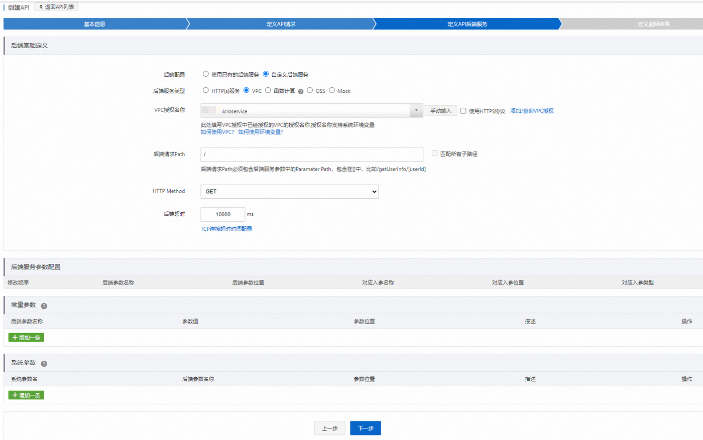
> △ 阿里云官方文档截图：后端服务类型选 VPC，引用 VPC 授权后填后端请求路径

**第三步：请求参数配置**

这个 API 的请求体是 JSON，直接点「**下一步**」跳过参数配置即可（API 网关会原样透传 JSON 请求体）。

**第四步：完成**

点击「**完成**」，API 创建成功。

---

**重复上述步骤，再创建以下 3 个 API：**

| API 名称 | Path | Method | 后端 Path |
|---------|------|--------|----------|
| `search-hybrid` | `/search/hybrid` | POST | `/search/hybrid` |
| `list-collections` | `/collections` | GET | `/collections` |
| `health` | `/health` | GET | `/health` |

> 注意 `list-collections` 和 `health` 是 GET 方法。

---

## 6.5 发布 API

> 创建完 API 后，还需要「发布」才能生效。阿里云 API 网关有「测试」和「线上」两个环境，我们直接发布到线上。

**操作路径：** API 网关控制台 → 「**API 管理**」→ 列表中勾选所有 4 个 API → 点击「**批量发布**」→ 选择「**线上**」→ 填写变更备注 →「**确认**」

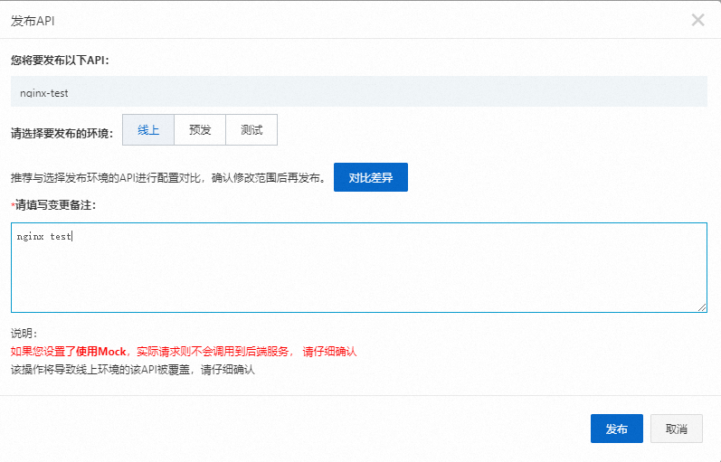
> △ 阿里云官方文档截图：发布弹窗——环境选"线上"，备注随意填（如"首次发布"）

发布后，API 状态从「草稿」变为「已发布」。

---

## 6.6 创建应用并获取 AppCode（写手身份凭证）

**操作路径：** API 网关控制台 → 左侧「**调用 API**」→「**应用管理**」→「**创建应用**」

| 选项 | 填写 |
|------|------|
| 应用名称 | `zsj-writers` |
| 描述 | 众生界写手访问凭证 |

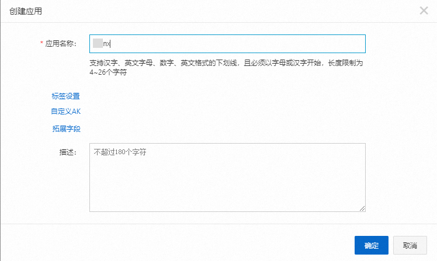
> △ 阿里云官方文档截图：创建应用——填名称即可，AppKey/AppCode 会自动生成

点击「**确定**」。**创建应用时系统会自动生成一个 AppCode**，点击应用名称进入详情页，在「**AppCode**」页签即可查看，类似：

```
7b3f9a2e1c4d8b6f0e5a2d9c3f7b1e4a8d2f5e1b
```

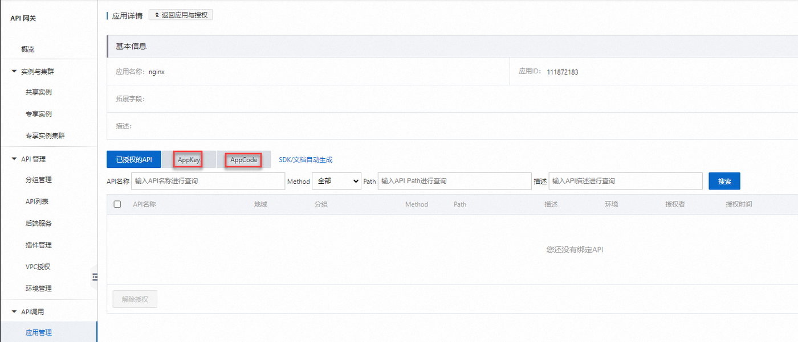
> △ 阿里云官方文档截图：应用详情页——AppCode、AppKey 都在这里查看

**把这串字符记下来**，这就是写手访问 API 的密码。

**把 4 个 API 授权给这个应用（重要——官方的授权是按 API 做的，不是按分组）：**

回到「**API 管理**」→ 列表中勾选 4 个 API → 点击「**授权**」→ 环境选「**线上**」→ 搜索并选中应用 `zsj-writers` → 「**添加**」→「**确定**」

> 不授权的话，用这个 AppCode 访问 API 会返回 403 鉴权失败。注意授权选择的环境要和 6.5 发布的环境一致（都是「线上」）。

---

## 6.7 测试 API 网关是否正常

**在本机 PowerShell 中测试（先测最简单的 health 接口）：**

```powershell
# 把下面的内容替换为你自己的域名和 AppCode
$domain = "abc123def456.cn-hangzhou.alicloudapi.com"
$appcode = "7b3f9a2e1c4d8b6f0e5a2d9c3f7b1e4a8d2f5e1b"

Invoke-RestMethod -Uri "https://$domain/health" `
    -Headers @{"Authorization" = "APPCODE $appcode"}
```

**预期输出：**

```
status
------
ok
```

如果出现 `403`：API 没有授权给应用（或授权环境不是线上），检查 6.6 步骤。
如果出现 `502`：API 网关到 SAE 不通，检查 VPC 授权配置和 CLB 地址是否填错。
如果出现 `503`：SAE 服务异常，查看 SAE 应用日志。

---

## 6.8 用 curl 命令测试（更通用的方式）

> 如果你后面想在 FinalShell（ECS 上）测试，curl 更方便：

```bash
# 在 ECS 的 FinalShell 终端里测试（不需要 AppCode，因为在内网直接访问 SLB）
curl http://192.168.1.yyy/health
```

**预期：** `{"status":"ok"}`

---

# 第七步：迁移本地数据到云端 Qdrant

---

> 第三步部署的 Qdrant 现在是空的，需要把一阶段在本地积累的所有数据（**14 个 collection**，几十万条记录）迁移到云端。
>
> 14 个 collection 清单：`novel_settings_v2`、`writing_techniques_v2`、`writing_techniques_batch_v1`、`case_library_v2`、`chapter_outlines`、`worldview`、`novel_plot_v1`、`dialogue_style_v1`、`emotion_arc_v1`、`power_vocabulary_v1`、`foreshadow_pair_v1`、`power_cost_v1`、`author_style_v1`、`judicial_cases_v1`（司法案例素材库，256篇/1007块，需先在本地运行三步建库命令，见一阶段指导书"司法案例素材库"章节）
>
> **本步骤时间较长（1-3小时），建议在网络稳定的环境下进行，不要中途断网。**

---

## 7.1 在项目中创建迁移脚本

迁移脚本 `tools/migrate_to_cloud.py` 的工作原理：

1. 连接本地 Qdrant（localhost:6333）和云端 Qdrant（ECS公网IP:6333）
2. 遍历本地所有 collection，逐批读取（每批 200 条），写入云端
3. 支持 `--only` 参数指定只迁移部分 collection，断点续传时使用
4. 迁移前自动在云端创建同结构的 collection（若已存在则追加，不会删除已有数据）

同时还需要创建 `core/retrieval/cloud_client.py`，这是写手工作流调用云端 API 的客户端模块（配置来自 config.json 的 `cloud_api` 字段）。

---

### → 执行实施计划 P2

打开终端，使用 opencode（或按指导书 AGENTS.md 规范手动创建），读取并执行：

```
docs/实施计划_二阶段_P2_数据迁移与写手接入.md
```

**执行后你将得到：**
- `tools/migrate_to_cloud.py` — 完整迁移脚本（连接验证 + 批量迁移 + 断点续传）
- `core/retrieval/__init__.py` — 包声明文件
- `core/retrieval/cloud_client.py` — 基础版云端检索客户端（AppCode 认证）

**验收：** 计划 P2 的 Stage 1-3 测试通过后继续下一节。

---

## 7.2 临时开放 ECS 的 6333 端口（仅迁移期间）

迁移时，本机需要直接访问云端 Qdrant 的 6333 端口，但安全组规则限制只有 VPC 内网能访问。需要临时添加公网访问规则。

**操作路径：** ECS 控制台 → 安全组 `zsj-sg` → 管理规则 → 入方向 → 手动添加：

| 协议 | 端口 | 授权对象 | 备注 |
|------|------|---------|------|
| TCP | 6333/6333 | 0.0.0.0/0 | ⚠️ **临时规则，迁移完成后必须立即删除** |

> **为什么要删除？** 开放 6333 端口到全网意味着互联网上任何人都能尝试连接你的数据库（虽然有密码保护），但减少攻击面是基本安全原则。

---

## 7.3 确认本机 Docker Desktop 在运行

确保本机 Docker Desktop 已启动（系统托盘看到 Docker 图标），本地 Qdrant 容器在运行：

```powershell
docker ps | findstr qdrant
```

**应看到** Qdrant 容器 STATUS 为 `Up ...`。

如果没有运行，启动它：

```powershell
docker start qdrant
```

---

## 7.4 执行迁移

打开 PowerShell，切换到项目目录，执行迁移脚本：

```powershell
cd D:\动画\众生界

# 把下面的 IP 和密码替换为真实的
E:\anaconda3\envs\python13\python.exe tools\migrate_to_cloud.py `
    --dst-host 47.98.xxx.xxx `
    --dst-api-key ZsjCloud2026@Qdrant#DB
```

**迁移过程中的输出示例：**

```
源：localhost:6333
目标：47.98.xxx.xxx:6333

共 14 个 collection 需要迁移

[1/14] 开始迁移：novel_settings_v2  (12,451 条数据)
  已迁移：12,451 / 12,451 条
  ✓ 完成：novel_settings_v2（12,451 条）

[2/14] 开始迁移：writing_techniques_v2  (986 条数据)
...
[8/14] 开始迁移：writing_techniques_batch_v1  (138,968 条数据)
  已迁移：138,968 / 138,968 条     ← 这个最慢，约 20-30 分钟
  ✓ 完成：writing_techniques_batch_v1（138,968 条）
...
[14/14] 开始迁移：judicial_cases_v1  (1,007 条数据)
  已迁移：1,007 / 1,007 条
  ✓ 完成：judicial_cases_v1（1,007 条）
...
🎉 全部 collection 迁移完成！
```

**如果迁移中断：**

不要担心，重新运行时加 `--only` 参数只迁移没完成的 collection（`recreate_collection` 会先清空再写入，幂等操作）：

```powershell
E:\anaconda3\envs\python13\python.exe tools\migrate_to_cloud.py `
    --dst-host 47.98.xxx.xxx `
    --dst-api-key ZsjCloud2026@Qdrant#DB `
    --only writing_techniques_batch_v1,case_library_v2
```

---

## 7.5 验证迁移结果

迁移完成后，用 FinalShell 连接 ECS，在终端检查：

```bash
# 检查云端 Qdrant 的 collection 列表和点数
curl -s -H "api-key: ZsjCloud2026@Qdrant#DB" \
    http://localhost:6333/collections | python3 -m json.tool
```

应该看到 14 个 collection，每个的 `points_count` 与本地一致。

> **关于 judicial_cases_v1**：这是真实司法案例知识库（1,007块/256篇，来自最高检spp.gov.cn），是一阶段用 `tools/scrape_spp.py → filter_judicial_cases.py → ingest_judicial_cases.py` 三步建立的。迁移时与其他 collection 无区别，migrate_to_cloud.py 会自动处理。

---

## 7.6 迁移完成后：立即删除临时安全组规则

**这一步很重要，不要忘记！**

**操作路径：** ECS 控制台 → 安全组 `zsj-sg` → 管理规则 → 入方向

找到授权对象为 `0.0.0.0/0` 端口为 `6333` 的规则，点击「**删除**」，确认。

恢复后，只有 VPC 内网（`192.168.0.0/16`）能访问 6333 端口。

---

# 第八步：配置写手机器

---

> 每个新写手的机器都需要做以下配置：
> 1. 安装 BGE-M3 模型（从 OSS 下载）
> 2. 修改 `config.json`，切换到云端模式
> 3. 添加云端检索客户端代码
>
> 管理员可以把本步骤整理成一页「写手配置指南」发给每个写手。

---

## 8.1 从 OSS 下载 BGE-M3 模型

**方法一：用 OSS Browser（推荐，图形化界面）**

1. 下载并安装 OSS Browser（参考第四步 4.2）
2. 打开 OSS Browser，用**写手自己的 AccessKey** 登录（AccessKey 由管理员在第九步创建并发送）

   | 字段 | 填写值 |
   |------|--------|
   | Endpoint | `oss-cn-hangzhou.aliyuncs.com` |
   | AccessKey ID | 管理员提供的 AccessKey ID |
   | AccessKey Secret | 管理员提供的 AccessKey Secret |

3. 进入 Bucket `zsj-models-2026`
4. 进入 `bge-m3/` 目录
5. 全选所有文件 → 右键「**下载**」→ 选择保存位置：`E:\huggingface_cache\hub\models--BAAI--bge-m3\`

> 如果没有 `E:\huggingface_cache\hub\` 目录，先手动创建。

**方法二：命令行下载（写手也可以用）**

> **安装 ossutil（注意：不是 pip 包！）** ossutil 是阿里云提供的独立可执行程序，官方安装方式是下载安装包：在阿里云帮助文档搜索「**安装 ossutil**」，下载 Windows 安装包（zip），解压后双击运行 `ossutil.bat`（或把解压目录加入 PATH 后直接用 `ossutil` 命令）。

```powershell
# 配置 ossutil（用写手自己的 AccessKey）
ossutil config `
    -e oss-cn-hangzhou.aliyuncs.com `
    -i 写手的AccessKeyID `
    -k 写手的AccessKeySecret

# 下载模型（-r 表示递归下载整个目录）
ossutil cp -r oss://zsj-models-2026/bge-m3/ `
    E:\huggingface_cache\hub\models--BAAI--bge-m3\
```

下载完成后，验证：

```powershell
# 检查模型目录是否存在关键文件
ls E:\huggingface_cache\hub\models--BAAI--bge-m3\snapshots\
```

应能看到一个哈希值命名的文件夹（如 `5617a9f61b028005a4858fdac845db406b...`）。

---

## 8.2 修改 config.json，切换到云端模式

打开 `D:\动画\众生界\config.json`（用 VSCode 或记事本），找到或添加 `"retrieval"` 节：

```json
{
  "retrieval": {
    "mode": "cloud",
    "api_endpoint": "https://abc123def456.cn-hangzhou.alicloudapi.com",
    "appcode": "7b3f9a2e1c4d8b6f0e5a2d9c3f7b1e4a8d2f5e1b",
    "dense_limit": 100,
    "sparse_limit": 100,
    "fusion_limit": 50
  }
}
```

> - `api_endpoint`：第六步 6.2 记录的 API 网关二级域名
> - `appcode`：第六步 6.6 创建的 AppCode
> - `dense_limit` / `sparse_limit` / `fusion_limit`：检索返回条数上限，默认值即可

**保存文件。**

---

## 8.3 在项目代码中添加云端检索客户端

> 如果你已经执行了实施计划 P2，`core/retrieval/cloud_client.py` 已经创建完毕，直接跳到 8.4 节。

`cloud_client.py` 的功能：
- 读取 `config.json` 中的 `cloud_api` 配置块（endpoint、appcode、enabled）
- 提供与本地 Qdrant 检索相同的接口：`search_dense()`、`search_hybrid()`、`health_check()`
- `enabled=false` 时不调用云端，方便本地调试

**若尚未执行 P2，现在执行：**

```
docs/实施计划_二阶段_P2_数据迁移与写手接入.md
```

**安装依赖（已执行 P2 且通过测试则跳过）：**

```powershell
E:\anaconda3\envs\python13\python.exe -m pip install requests
```

---

# 第九步：通过 RAM 分发写手账号

---

> **这步是管理员操作**，为每个写手创建独立的 RAM 子账号，发给他们 AccessKey，用于从 OSS 下载模型。
> AppCode 则是所有写手共用一个（因为 API 网关的鉴权粒度是「应用」级别，而不是「用户」级别）。

---

## 9.1 给每个写手创建 RAM 子账号

**操作路径：** RAM 控制台 → 左侧「**身份管理**」→「**用户**」→「**创建用户**」

| 字段 | 填写示例 |
|------|---------|
| 登录名称 | `writer-zhangsan`（用拼音，不用中文） |
| 显示名称 | `写手-张三` |
| 访问方式 | 只勾选「**使用永久 AccessKey 访问**」（旧版控制台叫「OpenAPI 调用访问」） |

> **为什么不勾选控制台访问？** 写手不需要登录阿里云控制台，只需要 AccessKey 来下载 OSS 模型。减少权限，更安全。

点击「**确定**」，同样保存弹出的 AccessKey ID 和 Secret（只显示一次）。

**批量创建（如果写手多）：** 可以在创建用户时勾选「批量创建用户」，一次创建多个。

---

## 9.2 为每个写手账号添加 OSS 只读权限

在用户列表，点击写手用户名 → 「**添加权限**」

在搜索框输入 `OSSReadOnly`，找到 `AliyunOSSReadOnlyAccess`，点击添加，确认。

> **这个权限允许什么？** 允许该用户调用 OSS 的 GetObject 接口（下载文件），但不允许上传、删除、修改 Bucket 设置。写手只能下载，不能误操作破坏模型文件。

---

## 9.3 准备发给写手的信息清单

管理员整理以下信息，通过私信（微信/钉钉）安全地发给对应写手：

```
【众生界云端接入配置信息 - 仅供 XXX 本人使用】

一、下载 BGE-M3 模型（OSS 配置）
  AccessKey ID：LTAI5tXXXXXXXXXXXXXXXXXX
  AccessKey Secret：XXXXXXXXXXXXXXXXXXXXXXXXXXXXXXXX
  OSS Endpoint：oss-cn-hangzhou.aliyuncs.com
  Bucket 名称：zsj-models-2026
  模型路径：bge-m3/
  本地保存路径：E:\huggingface_cache\hub\models--BAAI--bge-m3\

二、config.json 配置（填入项目目录中的 config.json）
  api_endpoint: https://abc123def456.cn-hangzhou.alicloudapi.com
  appcode: 7b3f9a2e1c4d8b6f0e5a2d9c3f7b1e4a8d2f5e1b

配置完成后，按实训指导书第八步操作即可。
如有问题联系：[管理员联系方式]
```

> **安全提示：**
> - AccessKey Secret 是高度敏感信息，不要发到公开群里
> - AppCode 也属于敏感信息，一对一私发
> - 告知写手：这些信息不要截图发给其他人，不要存到不安全的地方

---

# 第十步：验收测试

---

> 所有步骤完成后，做一次完整的端到端测试，确认整个链路通畅。

---

## 10.1 测试 API 网关连通性

```powershell
# 在管理员或写手机器上执行
$domain = "abc123def456.cn-hangzhou.alicloudapi.com"
$appcode = "7b3f9a2e1c4d8b6f0e5a2d9c3f7b1e4a8d2f5e1b"

Invoke-RestMethod -Uri "https://$domain/health" `
    -Headers @{"Authorization" = "APPCODE $appcode"}
```

**期望：** `status` 字段显示 `ok`

---

## 10.2 测试 collection 列表

```powershell
Invoke-RestMethod -Uri "https://$domain/collections" `
    -Headers @{"Authorization" = "APPCODE $appcode"}
```

**期望：** 看到 14 个 collection（包括 `novel_settings_v2`、`writing_techniques_v2`、`judicial_cases_v1` 等），每个的 `points_count` 与一阶段本地数据一致。

---

## 10.3 测试完整检索链路（本地 BGE-M3 → 云端 Qdrant）

在项目目录运行以下 Python 测试脚本：

```powershell
E:\anaconda3\envs\python13\python.exe -c "
from core.retrieval.cloud_client import CloudRetrievalClient, is_cloud_mode
from core.inspiration.embedder import Embedder

print('当前模式:', '云端' if is_cloud_mode() else '本地')

# 步骤1：本地 BGE-M3 把查询文字转成向量
embedder = Embedder()
vector = embedder.embed('剑道战斗描写技法')
print(f'向量维度: {len(vector)}（应该是 1024）')

# 步骤2：把向量发到云端 API，云端 Qdrant 检索结果返回
client = CloudRetrievalClient()
results = client.search_dense(
    vector=vector,
    collection='writing_techniques_v2',
    vector_name='dense',
    top_k=3,
)

print(f'检索到 {len(results)} 条结果：')
for r in results:
    name = r['payload'].get('name', r['payload'].get('title', '无名'))
    print(f'  [{r[\"score\"]:.2f}] {name}')
"
```

**期望输出：**

```
当前模式: 云端
向量维度: 1024（应该是 1024）
检索到 3 条结果：
  [0.91] 剑道描写三段式
  [0.87] 战斗节奏控制
  [0.85] 动作场景留白技法
```

---

## 10.4 opencode 全流程冒烟测试

正常打开 opencode，随便发一句「写第 X 章」，观察：
- opencode 能正常回复（说明工作流没有因为配置变更而崩溃）
- 如果有日志输出，应看到检索走的是云端（cloud_client 相关日志）

---

## 10.5 各步骤对应的验收标准汇总

| 步骤 | 验收方式 | 通过标志 |
|------|---------|---------|
| 第二步 VPC | VPC 控制台 | VPC 状态「可用」，交换机状态「可用」 |
| 第三步 ECS+Qdrant | `curl http://localhost:6333/collections` | 返回 `{"status":"ok"}` |
| 第四步 OSS | OSS Browser 查看 | `bge-m3/` 目录下有模型文件 |
| 第五步 SAE | SAE 应用日志 | `Uvicorn running on ...` |
| 第六步 API 网关 | PowerShell `Invoke-RestMethod` | `/health` 返回 `ok` |
| 第七步 迁移 | 云端 Qdrant collections 接口 | 14 个 collection，点数正确 |
| 第八步 写手机器 | Python 测试脚本 | 向量维度 1024，检索到结果 |
| 全链路 | opencode 写章节 | 正常完成，无报错 |

---

# 写手端日常使用说明

---

## 和一阶段相比，有什么变化？

| 事项 | 一阶段（本地） | 二阶段（云端） |
|------|------------|------------|
| 开机需要操作 | 启动 Docker Desktop，等 Qdrant 就绪 | **什么都不用做** |
| opencode 使用 | 正常 | **完全一样** |
| 写章节流程 | 正常 | **完全一样** |
| 检索速度 | 毫秒级（本地） | 多约 100-300ms（网络延迟），**几乎感知不到** |
| 数据共享 | 只有自己看得到 | **团队所有写手共享** |
| 机器要求 | 需要跑 Qdrant（内存要求高） | **只需要 BGE-M3（减少约 2GB 内存占用）** |

---

## 断网时怎么办？

写手机器断网时，云端 API 访问失败，检索会报错。临时解决方案：

1. 确保本机 Docker Desktop 在运行，Qdrant 容器在运行（一阶段的配置保留着）
2. 打开 `D:\动画\众生界\config.json`，把 `"mode"` 从 `"cloud"` 改为 `"local"`
3. 重新打开 opencode，恢复本地模式

网络恢复后记得改回 `"cloud"`。

---

## AppCode 泄露了怎么办？

如果不小心把 AppCode 发到群里或提交到了 git 仓库：

1. 管理员登录阿里云控制台 → API 网关 → 应用管理 → 点击 `zsj-writers` → AppCode 列表 → 点击「**禁用**」或「**删除**」该 AppCode
2. 点击「**创建 AppCode**」生成新的
3. 将新 AppCode 发给所有写手，更新他们的 `config.json`

整个过程不超过 5 分钟。

---

# 遇到问题怎么排查

---

## FinalShell 连不上 ECS

**检查清单（按顺序）：**

1. EIP 是否绑定？ → 打开 EIP 控制台，确认「绑定实例」列显示 ECS 实例名称
2. 安全组 22 端口是否开放全网？ → 进入安全组规则，确认有 `TCP 22 0.0.0.0/0` 入方向规则
3. .pem 文件路径是否正确？ → FinalShell 连接配置里重新指定私钥文件
4. ECS 是否在运行？ → ECS 实例列表状态是否「运行中」

---

## Qdrant 容器没有启动

```bash
# 在 FinalShell 里查看所有容器状态
docker ps -a | grep qdrant
```

如果看到 `Exited`，查看容器日志排查原因：

```bash
docker logs qdrant
```

常见原因和解决：
- `No space left on device`：磁盘满了，`df -h` 检查
- `permission denied`：目录权限问题，`chmod -R 755 /data/qdrant`
- `invalid config`：配置文件格式错误，重新生成

---

## SAE 应用一直重启（CrashLoopBackOff）

进入 SAE 控制台 → 应用详情 → 「**变更记录**」→ 点击最近一次变更 → 查看「**事件**」和「**日志**」

**最常见原因：环境变量填错**

- `QDRANT_HOST` 填的是公网 IP（应该填 VPC 内网 IP）
- `QDRANT_API_KEY` 和 Qdrant 配置文件里的密码不一致
- Qdrant 容器未启动（SAE 连不上就一直重启）

---

## API 网关返回 403（鉴权失败）

可能原因：
1. AppCode 填写有误 → 检查 `config.json` 里的 `appcode`
2. API 未授权给应用 → API 网关 → API 管理 → 勾选 API → 授权，确认 `zsj-writers` 在「线上」环境的授权列表里
3. API 未发布 → API 管理，确认 4 个 API 状态都是「已发布」

---

## API 网关返回 502（Bad Gateway）

API 网关到 SAE 的连接失败，检查：
1. VPC 授权配置里的 SLB 私网 IP 是否正确
2. SAE 应用是否在运行中（不是异常状态）
3. SAE CLB 是否已创建（进入 SAE 应用详情 → 基础信息 → 应用访问设置）

---

## 迁移时报错 `connection refused`

可能没有临时开放 6333 端口到公网，检查安全组规则是否添加了 `TCP 6333 0.0.0.0/0`。

---

## 检索速度变慢

正常情况是云端比本地多 100-300ms。如果慢很多（如超过 2 秒），可能是：
- SAE 实例数不够，触发了冷启动 → 把实例数调到 2
- ECS 负载过高 → 用 FinalShell 上方的监控面板查看 CPU 和内存

---

# 附录：账号密码清单

> **打印此页，填写实际值，妥善保管（不要存明文在电脑上）**

| 信息 | 实际值（手写填入） |
|------|------|
| 阿里云主账号登录名 |  |
| 阿里云主账号 ID | （12位数字，用于子账号登录URL） |
| RAM 管理员子账号 | `zsj-admin` |
| RAM 子账号登录密码 |  |
| RAM 子账号 AccessKey ID |  |
| RAM 子账号 AccessKey Secret |  |
| ECS EIP 公网 IP |  |
| ECS 数据盘挂载路径 | `/data` |
| Qdrant 密码 |  |
| SAE SLB 私网 IP |  |
| API 网关二级域名 | `xxx.cn-hangzhou.alicloudapi.com` |
| API 网关 AppCode |  |
| OSS Bucket 名称 | `zsj-models-2026` |
| ACR 仓库地址 | `registry.cn-hangzhou.aliyuncs.com/zsj/zsj-api` |

---

## 版本历史

| 版本 | 日期 | 主要变更 |
|------|------|---------|
| v1.0.0 | 2026-05-02 | 初版：ECS + Docker 单机方案 |
| v2.0.0 | 2026-05-02 | 架构重写：VPC + ECS + OSS + SAE + API 网关 + RAM |
| v3.0.0 | 2026-05-02 | 初学者扩写：每步骤增加服务说明、预期输出、排查指引 |
| v3.1.0 | 2026-05-02 | 新增附录 A（高并发）+ 附录 B（商用全场景） |
| v3.2.0 | 2026-05-02 | 设计审查：增加目录、修复示例密码警告、SSH IP 限制指引、SAE 内网 IP 步骤、安全组前向提示、附录标题对齐 |
| v3.3.0 | 2026-06-12 | 对照阿里云官方文档全文核对：修正 RAM 访问方式文案、ossutil 安装方式（非 pip）、SAE 私网 CLB 路径与代购机制、API 网关授权方式（按 API 授权而非分组绑定）、AppCode 认证归属（阿里云APP 认证的子选项）、流控/IP黑名单改插件体系、云监控菜单名；修复 collection 数量不一致（13→14）和附录命令路径控制字符；新增 12 张官方文档截图（docs/img/） |

---

---

# 附录 A：大规模商用高并发改造方案

> **本附录适用场景：** 当项目从「小团队内测」扩展到「平台级商用」——例如对外开放 API 服务，同时有数百至数千个并发写手请求，或者对 SLA（服务可用性）有明确要求（如 99.9% 可用）时，需要在二阶段基础上做进一步改造。
>
> **是否必须做？** 对于 10-20 人的写作团队，二阶段的单实例架构已经足够。本附录是扩展阅读，帮助学生理解商业系统的设计思路。

---

## A.1 先理解：高并发时哪里会成为瓶颈

我们先做一个简单的容量估算，找到系统中最弱的那个环节。

**假设场景：** 200 个写手同时在线，每人每分钟触发 5 次检索（每次 `/search/dense` 请求）。

```
并发写手：200 人
每人每分钟请求数：5 次
总 QPS（每秒请求数）：200 × 5 / 60 ≈ 17 QPS
峰值 QPS（假设早晚高峰集中）：≈ 50 QPS
```

**各层的处理能力（单实例估算）：**

| 层 | 组件 | 单实例能力 | 是否成为瓶颈 |
|---|------|----------|------------|
| 接入层 | API 网关 | 数万 QPS | **不是** |
| 计算层 | SAE（1核2G，1实例） | ~80-120 QPS | **临界，有风险** |
| 存储层 | Qdrant（4核8G ECS） | ~200-500 QPS（视向量维度） | **不是（但需要连接池）** |
| 网络层 | SLB | 数万 QPS | **不是** |

**结论：对于 50 QPS，当前架构的瓶颈在 SAE 的单实例上。** 下面的改造按优先级从高到低排列。

---

## A.2 改造一：SAE 弹性伸缩（最高优先级）

> **弹性伸缩是什么？** SAE 根据 CPU/内存负载，自动增加或减少实例数量。流量大时多开几台，流量小时只保留一台，既能抗峰值，又不浪费钱。

### A.2.1 配置弹性伸缩规则

**操作路径：** SAE 控制台 → 应用详情 → 「**弹性伸缩**」→「**创建弹性策略**」

**推荐配置：**

| 选项 | 配置值 | 说明 |
|------|--------|------|
| 伸缩策略类型 | **监控指标** | 根据指标自动调整 |
| 触发指标 | CPU 使用率 | 最直接反映负载 |
| 扩容触发值 | `70%` | CPU 超过 70% 就扩容 |
| 缩容触发值 | `30%` | CPU 低于 30% 就缩容 |
| 最小实例数 | `2` | 保证高可用，至少 2 台 |
| 最大实例数 | `10` | 防止无限扩容导致费用失控 |
| 冷却时间 | `120` 秒 | 扩容后等 2 分钟再评估，避免频繁抖动 |

> **为什么最小实例数设 2？**
> 单实例时，如果那台实例重启（SAE 部署新版本、实例故障），会有短暂的服务中断。2 台实例时，1 台重启另 1 台继续服务，用户感知不到。这叫「高可用」（HA）。

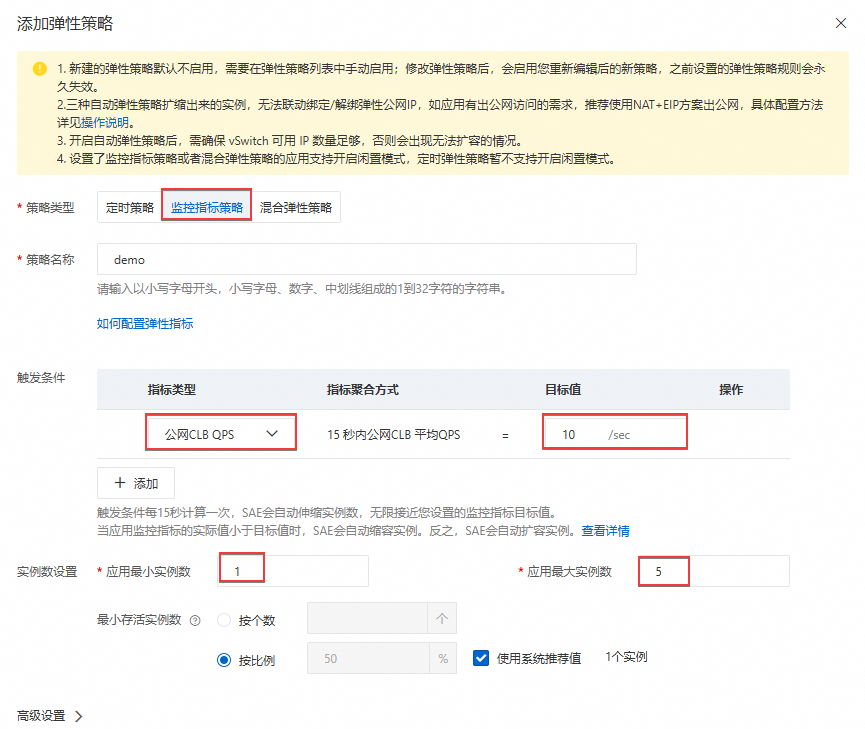
> △ 阿里云官方文档截图："添加弹性策略"面板，红框处即最小/最大实例数

点击「**保存**」，SAE 会立即启动第 2 个实例（因为最小值设为 2）。

### A.2.2 验证弹性伸缩生效

```powershell
# 用压测工具制造负载（见 A.5 节），观察 SAE 控制台实例数变化
# 正常情况：CPU 超 70% 后约 60-120 秒，实例数从 2 增加到 3、4...
```

**在 SAE 控制台「实例列表」查看：** 实例数应随负载变化而增减。

---

## A.3 改造二：Redis 缓存热查询（效果最显著）

> **为什么加缓存？**
> 向量检索很慢（10-100ms），但很多查询是重复的——比如所有写手都在搜「打斗场景技法」，这个向量每次都重新算一遍是浪费。把结果缓存 30 分钟，相同查询直接返回缓存，既减少 Qdrant 负载，又让响应变快 10 倍。

### A.3.1 购买阿里云 Redis（云数据库 Tair/Redis）

**操作路径：** 控制台 → 搜索「**云数据库 Redis**」→「**创建实例**」

| 选项 | 选择 |
|------|------|
| 版本 | Redis 7.0 |
| 实例规格 | `redis.master.small.default`（1GB，够用） |
| 网络类型 | **专有网络**，选 `zsj-vpc` 和 `zsj-switch-a` |
| 访问密码 | 设置一个强密码，记下来 |

创建完成后，在实例详情页找到「**连接信息**」，记录：
- **内网连接地址**：格式如 `r-bp1xxx.redis.rds.aliyuncs.com:6379`

### A.3.2 在 main.py 中添加缓存逻辑

修改后的 `zsj-api/main.py` 在检索前先查 Redis 缓存，命中直接返回（`latency_ms ≈ 0`），未命中再查 Qdrant 并写入缓存（TTL 30 分钟）。同时 `zsj-api/requirements.txt` 新增 `redis==5.0.8` 和 `python-jose[cryptography]==3.3.0` 依赖（后者供 JWT 使用）。

**→ 执行实施计划 P3**（完整代码见 `docs/实施计划_二阶段_P3_高并发商用改造.md` Step 1-2）

执行后重新构建 Docker 镜像并推送到 ACR，然后在 SAE 中添加环境变量（见 A.3.3 节）后重新部署。

### A.3.3 在 SAE 中添加 Redis 环境变量

进入 SAE 应用 → 「**应用设置**」→「**环境变量**」，新增以下变量：

| 变量名 | 变量值 |
|--------|--------|
| `REDIS_HOST` | Redis 实例的**内网连接地址**（不含端口，如 `r-bp1xxx.redis.rds.aliyuncs.com`） |
| `REDIS_PORT` | `6379` |
| `REDIS_PASSWORD` | Redis 实例密码 |
| `CACHE_TTL_SECONDS` | `1800`（30分钟，可按需调整） |

修改完环境变量后，点击「**重新部署**」让配置生效。

### A.3.4 验证缓存效果

连续两次调用同一个检索请求，对比响应：

```powershell
$domain  = "abc123def456.cn-hangzhou.alicloudapi.com"
$appcode = "你的AppCode"

# 第一次：cache miss，有延迟
Invoke-RestMethod -Method POST `
    -Uri "https://$domain/search/dense" `
    -Headers @{"Authorization"="APPCODE $appcode"; "Content-Type"="application/json"} `
    -Body '{"vector":[0.1,0.2,...],"collection":"writing_techniques_v2","top_k":3,"vector_name":"dense"}'

# 第二次：cache hit，latency_ms 应为 0
# 相同请求再发一次
```

第一次响应中 `"cache": "miss"`，第二次 `"cache": "hit"`，并且 `latency_ms` 为 `0`。

---

## A.4 改造三：API 网关限流（防止滥用和意外流量暴增）

> **为什么要限流？** 即使你的系统能抗 200 QPS，但如果某个写手的机器出 bug 进入死循环狂发请求，或者 AppCode 泄露被人恶意调用，整个系统会被打垮。限流就是设置「每个调用方每秒最多能发多少请求」的上限。

### A.4.1 为 API 配置流量控制插件

> 官方说明：API 网关的流量控制现已并入**插件**体系——创建一个"流量控制"类型的插件，再把它**绑定到已发布的 API**（不是绑定到分组）。

**操作路径：** API 网关控制台 → 左侧「**插件**」→「**创建插件**」→ 插件类型选「**流量控制**」

| 选项 | 填写 | 说明 |
|------|------|------|
| 插件名称 | `zsj-rate-limit` |  |
| 单位时间 | 秒 | 限流统计窗口 |
| API 流量限制 | `200` | 绑定该插件的每个 API 每秒总调用上限 |
| APP 流量限制 | `20` | 每个应用（AppCode）每秒最多 20 次 |

超出限制时 API 网关自动返回 `429 Too Many Requests`。

创建完成后，把插件**绑定到 API**：

**操作路径：** 插件列表 → `zsj-rate-limit` → 「**绑定 API**」→ 选择分组 `zsj-api-group`、环境「线上」→ 勾选 4 个 API → 确定

### A.4.2 在写手机器的 cloud_client.py 中添加重试逻辑

当服务端返回 `429`（限流触发）时，客户端等待一段时间后重试，而不是直接报错。P3 版 `core/retrieval/cloud_client.py` 实现了最多 3 次重试，等待时间分别为 0.5s / 1.0s / 2.0s（指数退避），并内置三状态熔断器（连续失败 5 次后熔断，60s 后自动恢复）。

**→ 执行实施计划 P3**（完整代码见 `docs/实施计划_二阶段_P3_高并发商用改造.md` Step 3-4）

执行 P3 后 `core/retrieval/cloud_client.py` 将被更新为含重试+熔断器的版本。

## A.5 改造四：Qdrant 升级为分布式集群（数据量超过 1000 万条时考虑）

> **什么情况下需要 Qdrant 集群？**
> - 单节点 Qdrant 的内存放不下全部向量（`case_library_v2` 已有 15 万条，每条 1024 维 float32 = 4KB，15 万条 = 约 600MB 内存，再加上 `writing_techniques_batch_v1` 的 13.8 万条，总内存需求约 2-3GB）
> - 数据量超过 1000 万条时，单节点性能不足
> - 对单点故障有零容忍要求（Qdrant 节点宕机，所有检索不可用）

### A.5.1 现阶段（150 万条以内）：优化单节点

在 ECS 规格不变的情况下，可以通过以下方式提升 Qdrant 性能：

**方案1：升级 ECS 规格（最简单）**

ECS 控制台 → 实例详情 → 「**更改实例规格**」，把 `ecs.c7.xlarge`（4核8G）升级到 `ecs.c7.2xlarge`（8核16G）。

Qdrant 默认会利用所有 CPU 核心并行处理检索请求，内存更大则更多向量在内存中（更快）。

**方案2：为高频查询的 collection 开启量化**

在 FinalShell 里执行以下命令（对大型 collection 开启 Scalar 量化，内存减少 4x，检索速度提升 2-3x）：

```bash
# 对 case_library_v2 开启量化（约 15 万条 collection）
curl -X PATCH \
  -H "api-key: ZsjCloud2026@Qdrant#DB" \
  -H "Content-Type: application/json" \
  http://localhost:6333/collections/case_library_v2 \
  -d '{
    "optimizers_config": {
      "indexing_threshold": 10000
    },
    "quantization_config": {
      "scalar": {
        "type": "int8",
        "quantile": 0.99,
        "always_ram": true
      }
    }
  }'
```

> **量化是什么？** 把向量的每个数值从 32 位浮点数（float32）压缩成 8 位整数（int8），存储空间减少 4 倍，检索时大部分计算在压缩后的数据上进行，速度更快，精度损失约 1-3%（可接受）。

### A.5.2 未来（1000 万条以上）：Qdrant 分布式部署思路

> 以下是概念介绍，不需要立即操作。

Qdrant 原生支持分布式集群，核心概念：

```
┌─────────────────────────────────────────────┐
│              Qdrant 集群（3节点）              │
│                                              │
│  ┌──────────┐  ┌──────────┐  ┌──────────┐   │
│  │  节点 1  │  │  节点 2  │  │  节点 3  │   │
│  │ shard 1  │  │ shard 2  │  │ shard 3  │   │
│  │ replica  │  │ replica  │  │ replica  │   │
│  │  of 2,3  │  │  of 1,3  │  │  of 1,2  │   │
│  └──────────┘  └──────────┘  └──────────┘   │
│                                              │
│  每个节点同时存储一部分数据（shard）            │
│  和其他节点数据的备份（replica）              │
└─────────────────────────────────────────────┘
```

- **分片（shard）**：把 1000 万条数据分成 3 份，每个节点存约 333 万条，检索时并行查询后合并结果
- **副本（replica）**：每份数据在 2 个节点上都有，一个节点宕机不影响服务

实际操作时，需要：
1. 购买 3 台 ECS，组成 VPC 内网
2. 每台安装 Qdrant 并配置集群模式（通过 Qdrant 的 `cluster` 配置项）
3. 创建 collection 时指定 `shard_number=3, replication_factor=2`

---

## A.6 压测验证（上线前必做）

> **压测是什么？** 在上线前，用工具模拟几百个并发用户同时发请求，观察系统在高负载下的表现——响应时间是否稳定？是否有报错？哪里先撑不住？

### A.6.1 安装 Locust（Python 压测工具）

```powershell
pip install locust
```

### A.6.2 编写压测脚本

压测脚本 `tests/locustfile.py` 模拟多个写手并发调用 `/search/dense`、`/search/hybrid`、`/health` 接口，验证系统在目标并发量下的 p95 响应时间（合格标准：< 500ms）和错误率（合格标准：< 1%）。

**→ 执行实施计划 P3**（完整代码见 `docs/实施计划_二阶段_P3_高并发商用改造.md` Step 5）

执行 P3 后运行压测：
```powershell
pip install locust
locust -f tests\locustfile.py --host https://<API网关地址> `
    --users 50 --spawn-rate 5 --run-time 2m --headless
```

### A.6.3 执行压测

```powershell
# 启动 Locust（会在本地 8089 端口开一个 Web 界面）
locust -f tests\locustfile.py --host https://abc123def456.cn-hangzhou.alicloudapi.com
```

浏览器访问 `http://localhost:8089`，在界面中：

| 选项 | 建议值 | 说明 |
|------|--------|------|
| Number of users | `50` | 先从 50 个并发用户开始 |
| Spawn rate | `5` | 每秒增加 5 个用户（平滑加压） |
| Host | 已自动填好 |  |

点击「**Start Swarming**」，开始压测。

**关注以下指标（实时显示）：**

| 指标 | 正常范围 | 需要关注 |
|------|---------|---------|
| RPS（每秒请求数） | 随用户数线性增长 | RPS 停止增长说明到达瓶颈 |
| 响应时间中位数（p50） | < 500ms | 超过 1s 用户体验变差 |
| 响应时间 99 分位（p99） | < 2000ms | 超过 5s 说明有严重问题 |
| 失败率（Failures） | 0% | 超过 1% 需要立即排查 |

### A.6.4 压测结果解读

**场景 1：SAE 单实例（配置弹性伸缩之前）**

```
并发 50 用户时：
  p50 响应时间：180ms  ✓
  p99 响应时间：850ms  ✓
  RPS：25
  失败率：0%

并发 120 用户时：
  p50 响应时间：640ms  ⚠️ 开始变慢
  p99 响应时间：4200ms ⚠️ 长尾严重
  RPS：32（瓶颈，不再线性增长）
  失败率：2%            ✗ 出现失败
```

→ 说明 SAE 单实例的瓶颈约在 80-100 QPS，超过后需要扩容。

**场景 2：SAE 弹性伸缩 + Redis 缓存（改造后）**

```
并发 200 用户时（加了缓存后相似查询命中缓存）：
  p50 响应时间：45ms   ✓ 大量缓存命中
  p99 响应时间：380ms  ✓
  RPS：130
  失败率：0%
```

→ 缓存命中率高时，效果非常显著。

---

## A.7 监控与告警配置

> **为什么要监控？** 上线后不可能盯着控制台，需要让系统「自动发现问题并通知你」。比如 SAE 实例崩了、Qdrant 磁盘快满了、响应时间突然变长，都应该立即收到通知。

### A.7.1 阿里云云监控基础告警

**操作路径：** 控制台 → 搜索「**云监控**」→ 进入控制台 → 「**报警服务**」→「**报警规则**」→「**创建报警规则**」（官方菜单用"报警"二字）

**为 ECS 配置关键告警（推荐）：**

| 监控项 | 告警条件 | 通知方式 |
|--------|---------|---------|
| CPU 使用率 | 连续 3 分钟 > 85% | 短信 + 邮件 |
| 磁盘使用率 | 连续 1 分钟 > 80% | 短信 + 邮件 |
| 内存使用率 | 连续 3 分钟 > 90% | 短信 + 邮件 |

**为 SAE 配置关键告警：**

进入 SAE 控制台 → 应用详情 → 「**监控**」，可以看到 CPU、内存、实例数的实时曲线。

SAE 对接云监控：「**报警管理**」→「**创建报警规则**」

| 监控项 | 告警条件 |
|--------|---------|
| 应用实例运行状态 | 实例健康数 < 最小实例数 |
| CPU 使用率 | 平均值 > 80% 持续 5 分钟 |

### A.7.2 在 SAE 服务中暴露业务监控指标

在 `main.py` 中添加简单的统计接口，让监控工具能抓取：

```python
# 在 main.py 末尾添加以下接口
from collections import defaultdict
import threading

_stats = defaultdict(int)
_stats_lock = threading.Lock()


@app.get("/metrics")
def metrics():
    """简单指标接口：返回各接口的调用次数和缓存命中情况"""
    with _stats_lock:
        return dict(_stats)
```

在 `search_dense` 和 `search_hybrid` 函数里添加统计：

```python
# 在返回结果前加一行
with _stats_lock:
    _stats[f"{req.collection}.calls"] += 1
    _stats[f"{req.collection}.cache_hits"] += (1 if cached else 0)
```

这样可以通过 `/metrics` 接口看到每个 collection 的调用量和缓存命中率，帮助决策哪些 collection 值得加缓存、TTL 设多长。

---

## A.8 高并发改造完成后的架构全貌

```
                    ┌──────────────────────────────────────────────────┐
                    │                 阿里云 VPC                        │
                    │                                                  │
写手A               │  ┌───────────────────────────────────────────┐   │
写手B    ──HTTP──►  │  │              API 网关                      │   │
写手C               │  │  限流：200 QPS / 20 QPS per AppCode        │   │
...（最多            │  └────────────────────┬──────────────────────┘   │
  数百并发）         │                       │ VPC 内网转发              │
                    │                       ▼                          │
                    │  ┌───────────────────────────────────────────┐   │
                    │  │              SLB 负载均衡                  │   │
                    │  └──────┬─────────────┬──────────────┬───────┘   │
                    │         │             │              │           │
                    │  ┌──────▼───┐  ┌──────▼───┐  ┌──────▼───┐      │
                    │  │ SAE实例1 │  │ SAE实例2 │  │ SAE实例3 │      │
                    │  │(自动扩缩)│  │ (自动扩缩)│  │ (自动扩缩)│      │
                    │  └──┬───┬──┘  └──┬───┬──┘  └──┬───┬──┘      │
                    │     │   │        │   │         │   │          │
                    │     │   └────────▼───▼─────────▘   │          │
                    │     │          ┌─────────┐          │          │
                    │     │          │  Redis  │          │          │
                    │     │          │  缓存   │          │          │
                    │     │          └─────────┘          │          │
                    │     └────────────────────────────────┘          │
                    │                       │ VPC 内网                 │
                    │                       ▼                          │
                    │  ┌───────────────────────────────────────────┐   │
                    │  │           ECS + Qdrant                    │   │
                    │  │  （可按需扩容实例规格或升级为集群）          │   │
                    │  └───────────────────────────────────────────┘   │
                    └──────────────────────────────────────────────────┘
```

**各改造的成本/效果速查：**

| 改造项 | 新增月费用（估算） | 效果 | 难度 |
|--------|----------------|------|------|
| SAE 弹性伸缩（最小2实例） | +¥100-300/月 | 高可用，抗峰值 | ★★☆ |
| Redis 缓存（1GB） | +¥50-100/月 | 热查询快 10 倍，Qdrant 压力减半 | ★★☆ |
| API 网关限流 | +¥0 | 防滥用，保护后端 | ★☆☆ |
| 客户端重试逻辑 | +¥0（代码改动） | 提升可靠性 | ★☆☆ |
| ECS 规格升级（8核16G） | +¥400-600/月 | Qdrant 性能翻倍 | ★☆☆ |
| Qdrant 向量量化 | +¥0 | 内存减半，速度+50% | ★★☆ |
| Qdrant 分布式集群（3节点）| +¥1500+/月 | 数据量 1000 万+ | ★★★ |

> **建议的升级路径：**
> 1. 第一步（10-50 人团队）：SAE 最小 2 实例 + API 网关限流 + 客户端重试 → 基础高可用
> 2. 第二步（50-200 人）：加 Redis 缓存 + SAE 弹性伸缩 → 性价比最高
> 3. 第三步（200 人以上）：ECS 规格升级 + Qdrant 量化 → 进一步提升
> 4. 第四步（商业平台级）：Qdrant 集群 + 多地域部署 → 企业级

---

---

# 附录 B：正式商用全场景改造指南

> **本附录覆盖的问题：** 高并发只是商用时遇到的挑战之一。当系统真正面向外部用户或企业客户时，还会碰到安全攻击、服务宕机、数据丢失、升级影响用户、多租户隔离、成本失控等一系列问题。本附录逐一说明如何应对。

---

## B.1 安全加固

> 二阶段使用 AppCode 鉴权，适合小团队内部使用。一旦对外开放（公开 API、对接第三方），需要更严格的安全措施。

### B.1.1 AppCode 升级为 JWT Token 鉴权

**AppCode 的问题：** 所有写手共用一个 AppCode，一旦泄露需要所有人同步换；无法区分是谁发出的请求；无法设置过期时间。

**JWT 方案：** 管理员用 `tools/issue_token.py` 为每位写手签发独立 JWT Token（`HS256` 算法），Token 含写手标识 `sub` 和过期时间 `exp`，写手填入自己的 `config.json`。SAE 服务读取 `Authorization: Bearer <token>` 头并验签，不合法的请求直接拒绝（401）。

**→ 执行实施计划 P3**（完整代码见 `docs/实施计划_二阶段_P3_高并发商用改造.md` Step 2 + Step 6）

执行 P3 后，为每位写手签发 Token：
```powershell
E:\anaconda3\envs\python13\python.exe tools\issue_token.py --sub zhangsan --days 180
```

写手把输出的 Token 填入自己机器 `config.json` → `cloud_api.jwt_token` 字段。

### B.1.2 网络层安全加固

**绑定自定义域名并开启 HTTPS（正式商用必须）**

HTTP 是明文传输，AppCode 或 JWT Token 会在网络上裸奔。必须启用 HTTPS。

**操作路径：** API 网关控制台 → 分组管理 → `zsj-api-group` → 「**域名管理**」→「**绑定自定义域名**」

1. 准备一个你自己的域名（在阿里云域名服务里购买，如 `zsj-api.yourdomain.com`）
2. 申请 SSL 证书：控制台 → 搜索「**数字证书管理**」→「**SSL证书**」→ 免费证书（DV）→ 申请，填写域名，按提示完成验证
3. 证书签发后（约 10 分钟），在 API 网关绑定域名时上传证书

绑定后，写手访问地址变为 `https://zsj-api.yourdomain.com/search/dense`，全程加密传输。

**配置安全组：关闭非必要端口**

商用后，定期检查 ECS 安全组规则，确保：

| 端口 | 应有状态 | 原因 |
|------|---------|------|
| 22（SSH） | 仅开放给**管理员 IP**，不对全网开放 | 减少被暴力破解的风险 |
| 6333（Qdrant） | 仅开放 VPC 内网 `192.168.0.0/16` | 数据库不暴露到公网 |
| 其他端口 | 全部关闭 | 最小化攻击面 |

将 SSH 的授权对象从 `0.0.0.0/0` 改为你办公室/家的固定 IP：

**第一步：查询你当前的公网 IP**

在你的管理员电脑上打开浏览器，访问以下任一地址（会直接显示你的公网 IP）：
- https://ifconfig.me
- https://ip.sb
- 百度搜索「我的IP」，结果页顶部会直接显示

记下显示的 IP，格式如 `123.45.67.89`。

> **注意：** 如果你的网络是 NAT（宽带共享多人），得到的 IP 是出口网关的 IP，限制这个 IP 后所有同一出口的人都能连，但已比完全公开安全很多。如果使用 4G/5G 热点，IP 会频繁变化，建议保留 `0.0.0.0/0` 但同时加固密钥认证（已做）。

**第二步：修改安全组规则**

**操作路径：** 安全组 `zsj-sg` → 入方向 → 22 端口规则 → 编辑 → 授权对象改为 `你的IP/32`

例如 IP 是 `123.45.67.89`，则填 `123.45.67.89/32`（`/32` 表示精确匹配单个 IP）。

> **换了网络后 SSH 连不上怎么办？** 重新查询新 IP，登录阿里云控制台更新安全组规则即可。紧急情况可用阿里云控制台的「**VNC 登录**」（网页终端）临时连接，不受安全组限制。

---

### B.1.3 防止 API 被恶意探测

**开启 API 网关的 IP 黑名单（防爬虫/攻击）：**

**操作路径：** API 网关控制台 → 「**插件**」→「**创建插件**」→ 类型选「**IP 访问控制**」→ 黑名单模式，添加已知恶意 IP → 创建后绑定到 API（与 A.4.1 流控插件的绑定方式相同）

**开启 API 网关的防重放攻击：**

阿里云 API 网关的签名鉴权（相比 AppCode 更安全）内置了防重放机制：每个请求带有时间戳和 Nonce（随机数），服务端验证时间戳在 15 分钟内且 Nonce 未使用过。截获的请求包无法被重复使用。

如果切换到签名鉴权：在 API 创建时选「**阿里云 APP 签名**」而不是 AppCode。

---

## B.2 数据备份与灾难恢复

> **不做备份的后果：** ECS 磁盘故障、误操作 `docker rm -f qdrant`、被黑客删库……任何一种情况都可能导致几十万条精心整理的知识库数据永久消失。数据是最宝贵的资产。

### B.2.1 Qdrant 数据自动备份到 OSS

备份脚本 `scripts/ecs_backup_qdrant.sh` 在 ECS 上执行，每天凌晨自动将 `/data/qdrant_storage` 打包上传到 OSS，并清理 30 天前的旧备份。

> ⚠️ 此脚本在 **ECS 上运行**，不在本机执行。P3 会将文件写入项目仓库，需手动 scp 到 ECS（见 B.2.2 节）。

**→ 执行实施计划 P3**（完整代码见 `docs/实施计划_二阶段_P3_高并发商用改造.md` Step 7）

执行 P3 后，按 B.2.2 节将脚本传到 ECS 并配置 cron。

### B.2.2 备份恢复演练（每季度做一次）

备份没用过等于没有。每季度做一次恢复演练：

```bash
# 1. 从 OSS 下载最新备份
ossutil cp "oss://zsj-models-2026/backups/qdrant/qdrant_最新日期.tar.gz" /tmp/restore.tar.gz

# 2. 停止 Qdrant 容器
docker stop qdrant

# 3. 备份当前数据（以防恢复失败）
mv /data/qdrant/storage /data/qdrant/storage_before_restore

# 4. 解压备份
tar -xzf /tmp/restore.tar.gz -C /data/qdrant/

# 5. 重启 Qdrant
docker start qdrant

# 6. 验证数据完整性（检查各 collection 点数是否正确）
curl -H "api-key: ZsjCloud2026@Qdrant#DB" http://localhost:6333/collections
```

**目标 RTO/RPO：**

| 指标 | 含义 | 目标值 |
|------|------|-------|
| RPO（Recovery Point Objective，恢复点目标） | 最多丢失多少时间的数据 | 24 小时（每天备份一次） |
| RTO（Recovery Time Objective，恢复时间目标） | 从发现问题到恢复服务需要多长时间 | < 2 小时 |

如果业务重要性更高，可以把备份频率改为每小时一次（修改 cron 表达式）。

---

### B.2.3 ECS 系统盘快照（防止系统级故障）

**操作路径：** ECS 控制台 → 「**快照**」→「**自动快照策略**」→「**创建策略**」

| 选项 | 配置 |
|------|------|
| 策略名称 | `zsj-daily-snapshot` |
| 执行时间 | 每天 02:00 |
| 保留时间 | 7 天 |
| 跨地域复制 | 可选，开启后备份在另一个地域也有一份 |

创建完成后，在 ECS 实例磁盘页面将此策略绑定到数据盘。

---

## B.3 服务稳定性与熔断降级

> **熔断器是什么？** 就像家里的电路保险丝：当下游服务（Qdrant 或云端 API）出现故障，客户端不应无限等待，而是快速失败并切换到降级方案（如返回空结果或提示用户稍后重试），避免故障扩散。

### B.3.1 在 cloud_client.py 中实现熔断器

`core/retrieval/circuit_breaker.py` 实现了线程安全的三状态熔断器（CLOSED → OPEN → HALF_OPEN → CLOSED）：
- **CLOSED**：正常状态，请求放行
- **OPEN**：连续失败 5 次后进入，所有请求直接拒绝（抛 `CircuitBreakerOpen`）
- **HALF_OPEN**：60s 超时后进入，放行 1 个探测请求，成功则恢复 CLOSED，失败则退回 OPEN

`core/retrieval/cloud_client.py` P3 版集成了熔断器：每次 `_post_with_retry()` 调用都经过熔断器，熔断时抛出 `RuntimeError` 而非无限等待。

**→ 执行实施计划 P3**（完整代码见 `docs/实施计划_二阶段_P3_高并发商用改造.md` Step 3-4）

### B.3.2 SAE 健康检查配置

SAE 支持配置「就绪探针」和「存活探针」，确保异常实例被及时摘除：

**操作路径：** SAE 应用详情 → 「**应用设置**」→「**健康检查**」

| 探针类型 | 配置 | 说明 |
|---------|------|------|
| 就绪探针（Readiness） | GET `/health`，初始延迟 10s，间隔 10s | 启动未就绪时不接收流量 |
| 存活探针（Liveness） | GET `/health`，初始延迟 30s，间隔 30s，失败 3 次重启 | 服务僵死时自动重启 |

这样，如果某个 SAE 实例 `/health` 连续 3 次返回非 200，SAE 会自动重启它，并在重启期间把流量切到其他健康实例，用户无感知。

---

## B.4 灰度发布与不停机升级

> **为什么需要灰度发布？** 直接把所有实例升级到新版本，如果新版本有 bug，所有用户同时受影响。灰度发布（也叫金丝雀发布）是先让 10% 的流量走新版本，确认没问题再全量切换。

### B.4.1 SAE 灰度发布流程

**第一步：构建新版本镜像并推送到 ACR**

```powershell
# 修改代码后，构建 v1.1 版本镜像
docker build -t registry.cn-hangzhou.aliyuncs.com/zsj/zsj-api:v1.1 .
docker push registry.cn-hangzhou.aliyuncs.com/zsj/zsj-api:v1.1
```

**第二步：在 SAE 中创建灰度批次**

**操作路径：** SAE 应用详情 → 「**应用设置**」→「**部署配置**」→ 将发布策略改为「**分批发布**」

- 总实例数：4（举例）
- 第一批次：1 台（占 25%）
- 批次间隔：观察 10 分钟
- 第二批次：剩余 3 台

点击「**部署**」，输入新镜像地址 `registry.cn-hangzhou.aliyuncs.com/zsj/zsj-api:v1.1`。

**第三步：观察第一批次的监控指标**

- SAE 监控：新实例的错误率是否正常
- API 网关日志：有没有新增 5xx 错误
- Qdrant 日志：有没有异常查询

**一切正常则继续下一批次，发现问题立即回滚：**

**操作路径：** SAE 应用详情 → 「**变更记录**」→ 找到上一个稳定版本的记录 → 「**回滚**」

回滚是一键操作，约 1-2 分钟恢复到上一个版本，用户几乎感知不到。

---

### B.4.2 数据库 Schema 变更的兼容性原则

当 Qdrant collection 结构需要变化时（如新增 payload 字段），要确保新旧版本 SAE 代码都能处理：

**安全的做法（向后兼容）：**
- 新增字段时，旧代码忽略新字段 → 安全
- 先升级数据（写入新字段），再升级代码 → 安全
- 先升级代码（代码兼容新旧格式），再升级数据 → 安全

**危险的做法（会导致回滚失败）：**
- 删除或重命名字段时，旧代码读不到 → 危险，需要特殊处理

---

## B.5 日志与全链路追踪

> 商用系统出了问题，最怕「不知道哪里出了问题」。好的日志和追踪系统能让你在 5 分钟内定位问题。

### B.5.1 结构化日志（JSON 格式）

把 `main.py` 的日志改为 JSON 格式，方便后续用日志平台过滤查询：

```python
# 在 main.py 开头替换 logging 配置
import json as _json

class JsonFormatter(logging.Formatter):
    def format(self, record):
        return _json.dumps({
            "time":    self.formatTime(record),
            "level":   record.levelname,
            "logger":  record.name,
            "msg":     record.getMessage(),
            "file":    f"{record.filename}:{record.lineno}",
        }, ensure_ascii=False)

handler = logging.StreamHandler()
handler.setFormatter(JsonFormatter())
logging.basicConfig(handlers=[handler], level="INFO")
```

**日志示例（JSON 格式，方便机器解析）：**

```json
{"time": "2026-05-02 15:30:01", "level": "INFO", "logger": "zsj-api", "msg": "cache MISS | writing_techniques_v2 top_k=5 87.3ms"}
```

### B.5.2 请求 ID 追踪

当一次写章节操作触发多次检索请求时，如何把这些请求关联起来？用 Request ID：

```python
import uuid
from fastapi import Request
from starlette.middleware.base import BaseHTTPMiddleware


class RequestIdMiddleware(BaseHTTPMiddleware):
    """为每个请求注入唯一 ID，方便在日志里追踪整条链路"""

    async def dispatch(self, request: Request, call_next):
        request_id = request.headers.get("X-Request-ID", str(uuid.uuid4())[:8])
        request.state.request_id = request_id
        response = await call_next(request)
        response.headers["X-Request-ID"] = request_id  # 把 ID 返回给调用方
        return response


app.add_middleware(RequestIdMiddleware)
```

在 `search_dense` 接口里加入 Request ID：

```python
@app.post("/search/dense")
def search_dense(req: DenseSearchReq, request: Request):
    rid = getattr(request.state, "request_id", "-")
    logger.info(f"[{rid}] dense | {req.collection} top_k={req.top_k}")
    # ...
```

这样，写手机器在请求头里带上 `X-Request-ID`，服务端所有相关日志都能通过这个 ID 关联起来。

### B.5.3 接入阿里云日志服务（SLS）

> SLS（Simple Log Service，日志服务）是阿里云的集中日志平台，可以把 SAE、ECS 的日志都汇聚到一起，用 SQL 查询，设置关键字告警。

**操作路径：** 控制台 → 搜索「**日志服务**」→ 开通 → 创建 Project 和 Logstore

SAE 应用对接 SLS：

**SAE 控制台 → 应用详情 → 「日志管理」→「添加日志采集配置」**

| 选项 | 配置 |
|------|------|
| 日志类型 | 标准输出（容器 stdout） |
| 日志服务 Project | 选择刚创建的 Project |
| Logstore | 选择对应的 Logstore |

配置后，SAE 应用的所有 `print` 和 `logging` 输出都会实时推送到 SLS，可以在 SLS 控制台搜索：

```sql
-- 查找最近 1 小时的所有错误
level: "ERROR" | SELECT * ORDER BY time DESC LIMIT 100

-- 统计各 collection 的请求量
msg: "dense |" | SELECT split(msg, '|')[2] as collection, count(*) as calls GROUP BY collection

-- 查找响应时间超过 1 秒的请求
msg: "ms" | SELECT * WHERE cast(regexp_extract(msg, '(\d+\.\d+)ms', 1) as double) > 1000
```

---

## B.6 多租户改造（对外提供 SaaS 服务）

> **什么是多租户？** 如果你的平台要同时为多个出版社/公司提供服务，每家公司有自己的知识库数据、自己的写手账号，互相不能看到对方的数据，这就是多租户（Multi-tenant）场景。

### B.6.1 数据隔离方案对比

| 方案 | 实现方式 | 优点 | 缺点 | 适合场景 |
|------|---------|------|------|---------|
| **Collection 前缀隔离** | 每个租户的 collection 加 `tenant_id_` 前缀 | 实现简单，无需改动 Qdrant 部署 | collection 数量随租户增长 | 租户少（<50家） |
| **Payload Filter 隔离** | 所有租户数据在同一 collection，每条数据有 `tenant_id` 字段，查询时加 filter | 存储高效，无需多份索引 | 租户数据在同一索引，理论上存在侧信道风险 | 租户多但数据量小 |
| **独立 Qdrant 实例** | 每个租户一套独立的 ECS + Qdrant | 完全隔离，互不干扰 | 成本高，管理复杂 | 高端企业客户，SLA 要求严格 |

**推荐方案（租户数 < 20 家）：Collection 前缀隔离**

修改 `main.py`，在 JWT Token 里携带 `tenant_id`，检索时自动加前缀：

```python
# 修改 search_dense 接口
@app.post("/search/dense")
def search_dense(req: DenseSearchReq, token_payload: dict = Depends(verify_token)):
    tenant_id  = token_payload.get("tenant", "default")
    # collection 名称自动加租户前缀
    collection = f"{tenant_id}_{req.collection}"

    # 后续检索逻辑不变，只是 collection_name 变了
    results = qdrant.search(collection_name=collection, ...)
    return {"results": [...]}
```

签发 Token 时加入 `tenant` 字段：

```python
payload = {
    "sub":    "zhangsan",
    "tenant": "publisher_a",   # 出版社A
    "exp":    ...,
}
```

这样张三（出版社A）检索 `writing_techniques_v2`，实际访问的是 `publisher_a_writing_techniques_v2`，完全与出版社B的数据隔离。

### B.6.2 按租户计费

`tools/export_billing.py` 从阿里云 SLS 日志服务导出的 CSV 日志中，按写手 ID 统计各接口调用次数，输出计费报告。

**→ 执行实施计划 P3**（完整代码见 `docs/实施计划_二阶段_P3_高并发商用改造.md` Step 8）

执行 P3 后，从 SLS 下载日志 CSV 并运行：
```powershell
E:\anaconda3\envs\python13\python.exe tools\export_billing.py `
    --log-file docs\m7_artifacts\api_logs.csv `
    --output docs\m7_artifacts\billing_report.csv
```


## B.7 成本控制与费用预警

> **云服务的常见「踩坑」：** 忘记删除测试资源、SAE 实例数被弹性伸缩放大后没有缩回来、流量突增导致流量费暴涨……学生实训最常见的问题是「月底账单远超预期」。

### B.7.1 各服务费用估算（华东1杭州，2026年价格参考）

| 服务 | 规格 | 约月费 | 说明 |
|------|------|-------|------|
| ECS | ecs.c7.xlarge（4核8G），包年包月 | ¥200-300 | 固定费用 |
| 数据盘 | ESSD 100GB | ¥50 | 固定费用 |
| EIP | 按流量计费，100Mbps峰值 | ¥10-50 | 取决于上传流量 |
| OSS | 10GB 存储 + 下载流量 | ¥5-20 | 初期低，写手多了流量增加 |
| SAE | 1核2G × 2实例（最小高可用） | ¥100-200 | 弹性，实际低于上限 |
| Redis | 1GB 标准版 | ¥50-100 | 固定 |
| API 网关 | 100万次调用 | ¥3 | 极低 |
| SLB | 小型（slb.s1.small） | ¥15 | 固定 |
| **合计** | | **≈ ¥430-740/月** | 小团队可接受 |

### B.7.2 设置费用告警

**操作路径：** 控制台 → 右上角「**费用与成本**」→「**预算管理**」→「**新建预算**」

| 选项 | 设置 |
|------|------|
| 预算名称 | `zsj-monthly-budget` |
| 预算类型 | 月度费用 |
| 预算金额 | ¥1000（超出这个数就告警） |
| 告警阈值 | 80%（¥800 时发短信提醒） |

这样当月费用接近预算时你会提前收到通知，有时间排查是否有异常资源消耗。

### B.7.3 常见费用失控场景及防范

| 场景 | 原因 | 预防措施 |
|------|------|---------|
| SAE 实例数暴增 | 弹性伸缩没设上限，bug 导致大量失败请求 | 设置最大实例数 10，同时设费用告警 |
| OSS 流量费暴增 | 写手下载模型代码写成了死循环 | OSS 设置单用户流量上限；客户端加本地缓存检查 |
| ECS 带宽费 | 迁移脚本忘记停，一直跑 | 迁移完成立即关闭 6333 临时规则 |
| Redis 内存满 | 缓存没有设 maxmemory 导致 OOM | Redis 实例配置 `maxmemory-policy: allkeys-lru`（自动淘汰最久未用的缓存） |

**为 Redis 配置内存淘汰策略：**

**操作路径：** Redis 实例控制台 → 「**参数设置**」→ 找到 `maxmemory-policy` → 改为 `allkeys-lru`

这样 Redis 内存满时会自动淘汰最久未用的缓存键，而不是报错或拒绝写入。

---

## B.8 商用上线检查清单

> 在正式对外开放之前，对照以下清单逐项确认。

### 安全

- [ ] HTTPS 已启用（自定义域名 + SSL 证书）
- [ ] SSH 22 端口已限制为管理员 IP，不对全网开放
- [ ] Qdrant 6333 端口仅 VPC 内网可访问
- [ ] AppCode / JWT Token 未出现在代码仓库或群聊中
- [ ] RAM 子账号遵循最小权限原则（写手只有 OSS 只读，无控制台权限）
- [ ] API 网关已配置限流策略

### 可用性

- [ ] SAE 最小实例数 ≥ 2（高可用）
- [ ] SAE 已配置就绪探针和存活探针
- [ ] SAE 已配置弹性伸缩规则（最大实例数已设上限）
- [ ] 熔断器已实现，云端故障时客户端优雅降级
- [ ] ECS 关键指标（CPU / 磁盘 / 内存）已设告警

### 数据

- [ ] Qdrant 数据每日自动备份到 OSS
- [ ] ECS 数据盘已配置自动快照策略
- [ ] 做过一次备份恢复演练，确认备份可用
- [ ] 临时开放的安全组规则（数据迁移时的 6333 全网规则）已关闭

### 运维

- [ ] SAE 日志已接入 SLS（集中日志）
- [ ] 已配置费用预算告警
- [ ] 发布流程已改为分批发布（灰度）
- [ ] 准备好回滚操作步骤（变更记录里能一键回滚）
- [ ] 写手端「断网应急手册」已发给所有写手

### 压测

- [ ] 已用 Locust 做过 200 并发压测，无明显失败
- [ ] 确认弹性伸缩在压测中能自动触发
- [ ] 确认 Redis 缓存在重复查询时命中率 > 60%
